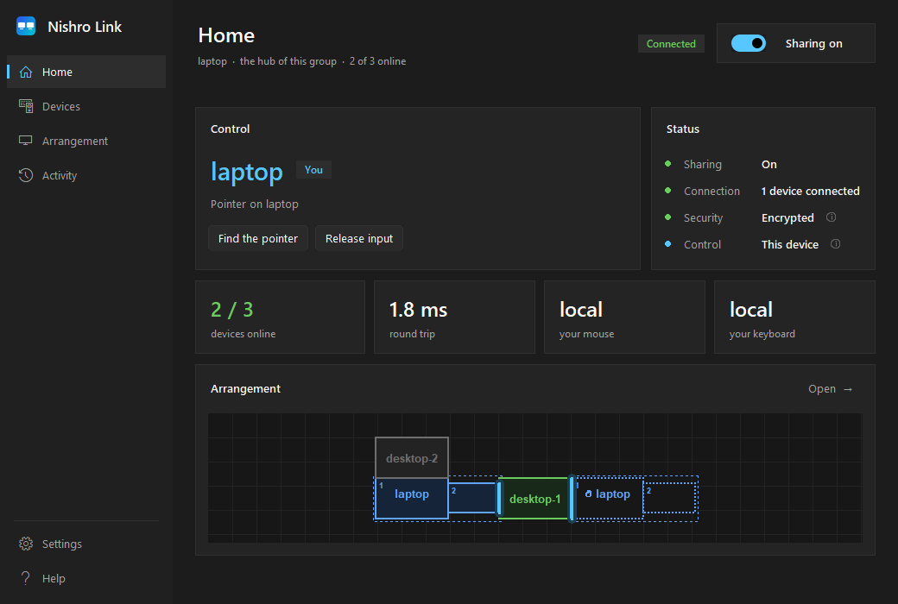
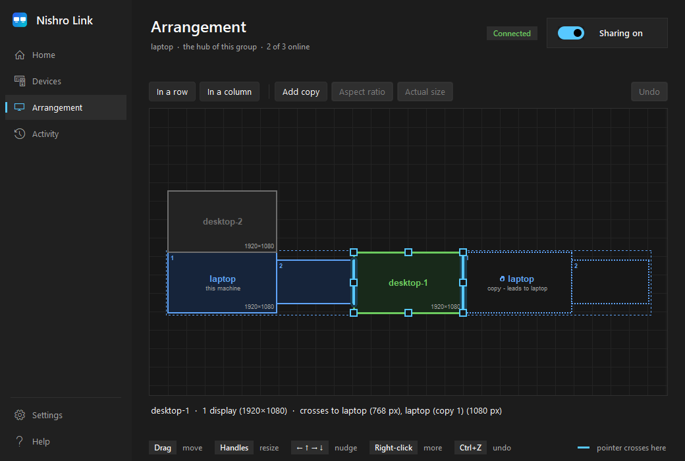
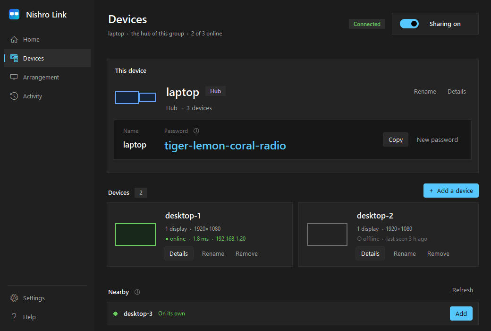
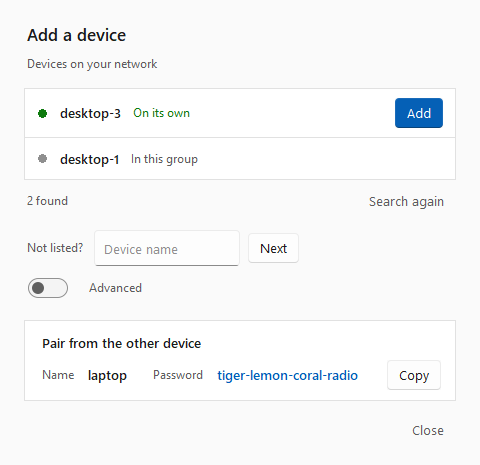
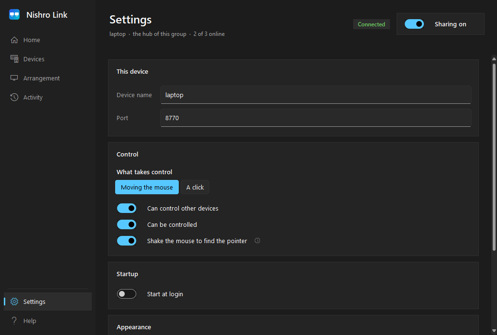

<p align="center">
  
</p>

<h1 align="center">Nishro Link</h1>

<p align="center">
  <b>One mouse and keyboard across your Windows and Linux computers.</b><br>
  Push the pointer off one screen and it carries on onto the next computer.
</p>

<p align="center">
  <a href="https://github.com/nishro888/nishro-link/actions/workflows/ci.yml"></a>
  <a href="https://github.com/nishro888/nishro-link/releases"></a>
  
  <a href="LICENSE"></a>
</p>

<p align="center">
  <a href="https://github.com/nishro888/nishro-link/releases/latest"><b>Download</b></a> ·
  <a href="docs/manual.md">Manual</a> ·
  <a href="docs/requirements.md">Requirements</a> ·
  <a href="docs/faq.md">FAQ</a> ·
  <a href="docs/security.md">Security</a>
</p>

<p align="center">
  
</p>

A software KVM: type and point on several computers with one set of hands.
The keyboard follows the pointer, text copied on one computer pastes on
another, and **whichever mouse you touch takes control** - there is no fixed
"server" with the keyboard.

> **1.0.** Every 1.x works with every other 1.x. Nishro Link is developed and
> used daily on a Windows laptop and an Ubuntu desktop, with an automated suite
> of about 1,260 tests on Windows and Linux; it has not been independently
> audited. Read the [limitations](#limitations).

## Why Nishro Link

- **Any machine drives.** Move any computer's mouse and it takes over; the
  others follow. No server and client roles to choose.
- **Pair by name and a password.** Each device shows four plain words
  (`tiger-lemon-coral-radio`). Pick the device, type its words, done. No IP
  addresses - if the router moves a device, it is found again by name.
- **Wayland without prompts.** On Linux it works at the kernel's input layer,
  so it behaves the same on Wayland and X11 - and at the **login and lock
  screens**, on Windows too.
- **An arrangement editor that means it.** Every monitor drawn as it is,
  placed freely. Resize a box to put a border exactly where you want it -
  without ever changing the pointer's speed. Add a **copy** of a machine for
  wrap-around.
- **Encrypted with standard cryptography.** X25519, HKDF-SHA256 and
  ChaCha20-Poly1305 - the primitives WireGuard uses - with the password never
  sent. No cloud, no account, no telemetry.
- **It gives your machine back.** If a link drops or anything is in doubt,
  input returns to each computer at once. **Both Ctrl keys** always free the
  machine you are at.

## Features

| | |
|---|---|
| **Groups of devices** | as many as you have, managed from any of them: rename, remove, set who may control whom |
| **Arrangement** | drag, snap, resize; bright lines show where the pointer crosses; changes apply everywhere at once, Ctrl+Z undoes |
| **Wrap-around** | place a copy of a machine: right off the last screen comes back in on the first |
| **Find the pointer** | shake the mouse: every screen darkens but a circle round the pointer, on whichever computer it is |
| **Monitors** | several per computer; plugged in or out, noticed within seconds |
| **Clipboard** | text, shared |
| **Quick on Wi-Fi** | a controlled computer keeps its radio awake; bursts of movement are sent together |
| **From boot** | runs as a system service on both systems, so it works before anyone signs in |
| **A proper program** | light and dark themes, Windows 11-style controls, keyboard shortcuts, a setup wizard and a Debian package with an App Center page |

<table>
  <tr>
    <td></td>
    <td></td>
  </tr>
  <tr>
    <td align="center"><sub>Arrangement: a laptop with two monitors, two desktops, and a copy of the laptop for wrap-around</sub></td>
    <td align="center"><sub>Devices: this device's password, the group, and devices nearby</sub></td>
  </tr>
  <tr>
    <td></td>
    <td></td>
  </tr>
  <tr>
    <td align="center"><sub>Adding a device</sub></td>
    <td align="center"><sub>Settings</sub></td>
  </tr>
</table>

## Install

Every computer needs Nishro Link **1.x** (any 1.x works with any other), on the
**same local network**. Downloads are on the [releases page](https://github.com/nishro888/nishro-link/releases/latest).

| | Download | Needs |
|---|---|---|
| **Windows** | `NishroLink-Setup-1.0.0.exe` | Windows 10 or 11, 64-bit; administrator rights to install |
| **Ubuntu, Debian, Mint, Pop!_OS...** | `nishro-link_1.0.0_all.deb` | Ubuntu 20.04+ or Debian 11+ (or derivatives); Wayland or X11 |
| **Other Linux** | Source code | Python 3.8+, Tk, evdev, cryptography 2.5+ - [instructions](docs/install-linux.md#other-distributions) |

**Windows:** run the setup and approve the one permission prompt. The
installer is not code-signed yet: if SmartScreen warns, choose **More info →
Run anyway**. [Details](docs/install-windows.md).

**Ubuntu and Debian:** open the `.deb` (the App Center installs it), or

```bash
sudo apt install ./nishro-link_1.0.0_all.deb
```

then log out and back in once. [Details](docs/install-linux.md).

Full [requirements](docs/requirements.md): what is tested, what is supported,
and what each library is for. Every release file is built by GitHub Actions
from the tagged source and listed in `SHA256SUMS`.

## Quick start

1. Open Nishro Link on both computers. Each shows its **name** and
   **password** on the **Devices** page.
2. On either one: **Add a device**, pick the other, and type the password it
   shows. The dialog follows each step until it says **connected**, or says
   why not.
3. Open **Arrangement** and drag the screens to match your desk.

Push the pointer across a bright line to cross. Move any computer's mouse to
take control from there. The [manual](docs/manual.md) covers everything, step
by step with pictures.

## Limitations

- **Windows and Linux only.** No macOS.
- **Local network only** - not across the internet.
- **Clipboard is text only**; no file transfer yet.
- **Linux:** after a monitor is plugged in or out, restart Nishro Link on that
  computer for the pointer to use the new size (the arrangement updates on its
  own). *Find the pointer* works on GNOME only, for now.
- **Tested** on Windows 10 22H2 and Ubuntu 26.04 (GNOME, Wayland) as physical
  machines; groups of three in automated tests only. CI runs the tests on
  Ubuntu 20.04 and Debian 11 with their own Python (3.8, 3.9) and libraries,
  and test-installs the `.deb` on Ubuntu 20.04, 22.04, 24.04 and Debian 11, 12.
- **Windows:** any account signed in to the computer can use Nishro Link's
  controls on it ([security](docs/security.md#who-is-trusted)).
- The Windows installer is **not code-signed** yet, and the code has **not been
  independently audited**.

## Roadmap

Ideas, in no fixed order - not promises:

- images and files over the clipboard
- monitor changes on Linux picked up without a restart
- *Find the pointer* on KDE Plasma and other desktops
- a code-signed Windows installer, and winget
- an RPM package for Fedora

Suggestions and votes are welcome in
[Discussions](https://github.com/nishro888/nishro-link/discussions).

## How it works

One device in a group is the **hub**: the others connect to it, and it decides
who holds control, so two computers can never both think they are driving.
That is an administrative role only - any computer's mouse can drive.

The arrangement is a plane of rectangles, compiled into doorways; the pointer
moves in each computer's own pixels and crosses only through them, so the size
a box is drawn at never changes its speed. Input is captured with low-level
hooks on Windows and evdev on Linux, and played back with `SendInput` and
uinput.

[DESIGN.md](link/DESIGN.md) is the full design: the safety properties (the
mouse never freezes, you always get your machine back, no key stays down), the
wire protocol, reconnection, discovery and security.
[Design decisions](docs/design-decisions.md) explains *why* each choice was
made - the architecture, the encryption, the protocol - with diagrams.

## Contributing

Bug reports, ideas and pull requests are welcome - see
[CONTRIBUTING.md](CONTRIBUTING.md). Please report security issues privately:
[SECURITY.md](SECURITY.md).

```bash
git clone https://github.com/nishro888/nishro-link && cd nishro-link
pip install -e ".[dev]"            # cryptography, pytest, ruff (and evdev on Linux)
python -m link.nishro_link         # run from source
python -m pytest                   # the tests - no network, no real input
```

The tests never touch the real network or input: discovery is confined to
loopback, and multi-machine tests run real nodes over local sockets with the
mouse, keyboard and screen faked.

## License

[MIT](LICENSE). Generated passwords use the EFF's
[short word list 1](https://www.eff.org/dice) (CC BY 3.0 US). The controls are
drawn with rdbende's [Sun Valley ttk theme](https://github.com/rdbende/Sun-Valley-ttk-theme)
(MIT). See [THIRD_PARTY_NOTICES.md](THIRD_PARTY_NOTICES.md).
