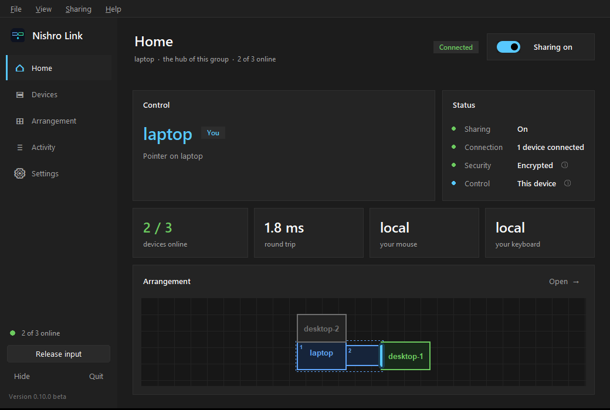
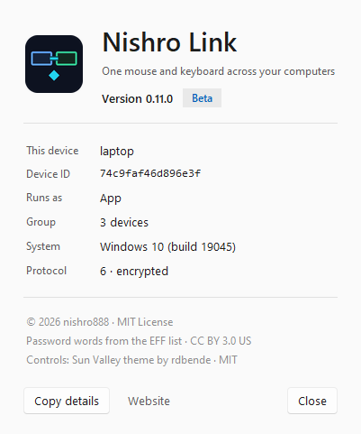

# Nishro Link

**One mouse and keyboard across several computers, on Windows and Linux.**
Push the pointer off the edge of one screen and it carries on onto the next
computer's. Type, and it goes to whichever screen the pointer is on. Copy on one
machine, paste on another. Any machine's own mouse can take over at any time -
there is no fixed "server with the keyboard".

| Light | Dark |
|---|---|
|  |  |

> **Status: beta (v0.13).** Developed and tested on a Windows 10 laptop and an
> Ubuntu (Wayland) desktop, with an automated test suite - read
> [Limitations](#limitations) first.

## Features

- **Any machine drives.** Whichever mouse you touch takes control. The others
  follow. Keyboards follow the pointer.
- **Several devices in one group.** Any number can join, and the hub relays
  between them - so one desktop's mouse can drive another desktop's screen
  through it.
- **Add a device by name and one password - from either side.** Every device
  shows its name and a generated password of four plain words
  (`tiger-lemon-coral-radio`). Devices nearby are listed on the Devices page;
  pick one, type the password it shows, and watch each step until it says
  connected - or says why not, and what to do. No IP addresses: if DHCP moves
  a device, it is found again automatically.
- **Manage any device from any device.** Click a device for its details -
  displays, address, version, when it joined - or right-click it. Rename it
  (live, no restart), remove it, and set what it may do: take control of the
  others, be controlled by them. One that may not be controlled is a wall the
  pointer stops at.
- **A real arrangement editor.** Every machine is drawn as its actual monitors.
  Drag them to match your desk - beside, above, below, against a particular
  monitor - and bright lines show exactly where the pointer will cross. A
  change reaches every device the moment you drop it; Ctrl+Z undoes.
- **Borders exactly where you want them.** Resize any box by its handles, free
  of its aspect ratio, so a small laptop screen can meet a big monitor along
  its whole edge. Only where the borders meet changes - never the pointer's
  speed. *Aspect ratio* and *Actual size* put it back.
- **Wrap-around.** Place a copy of a machine anywhere, and pushing into the
  copy lands you on the machine itself: put a copy of the laptop to the right
  of the AIO, and right from the AIO comes back round to the laptop.
- **Find the pointer.** Lost it among the screens? Shake the mouse: every screen
  but a circle round the pointer darkens - on whichever computer it is (on
  Ubuntu, GNOME's own ripple). Also in the Sharing menu; can be turned off.
- **Quick on Wi-Fi.** A machine being controlled keeps its Wi-Fi radio awake,
  so the pointer does not stall after a pause, and bursts of mouse reports go
  out together.
- **Monitors plugged in or out** are noticed within seconds and the arrangement
  updates everywhere.
- **Shared clipboard** (text).
- **Encrypted.** Every link is encrypted with a fresh key each time it
  connects, and devices prove the password to each other without ever sending
  it.
- **It gives your machine back.** If a link dies, a device leaves, or anything is
  in doubt, local input is restored at once. Pressing **both Ctrl keys**
  together, or *Release input* in the window, always frees the machine you are
  at.
- **A proper program.** Windows 11-style buttons, switches and text boxes, in
  a light and a dark theme that follow the computer's setting (or pick one). A
  setup wizard, a Start Menu entry, an uninstaller, a menu bar - File, View,
  Sharing, Help - with keyboard shortcuts, a quick start guide, and an About
  window with the version - and any device running a different one.

| Devices | Arrangement |
|---|---|
|  |  |

| Adding a device | About |
|---|---|
|  |  |

## Install

### Windows 10 / 11

Download **`NishroLink-Setup-0.13.0.exe`** from the [Releases](../../releases)
page and run it. Click through the wizard and approve the one permission
prompt. Nishro Link then:

- runs in the background from the moment Windows starts - so another computer's
  mouse and keyboard also work on the lock and sign-in screens;
- is allowed through the firewall on private networks;
- appears in the Start Menu, and in **Settings → Apps** for uninstalling.

The installer is not code-signed yet, so Windows SmartScreen may warn the first
time: choose **More info → Run anyway**.

### Ubuntu, Debian and derivatives (Wayland and X11)

Download **`nishro-link_0.13.0-beta_all.deb`** from the
[Releases](../../releases) page and open it - the App Center installs it - or:

```bash
sudo apt install ./nishro-link_0.13.0-beta_all.deb
```

It installs everything it needs and runs Nishro Link in the background from
boot, so it also works on the login and lock screens. **Nishro Link** appears
in the app menu. Log out and back in once afterwards (the window says so if it
is needed).

If a firewall (ufw) is running: `sudo ufw allow 8770`. To remove it:
`sudo apt remove nishro-link`.

### Building it, or installing without an installer

```powershell
powershell -ExecutionPolicy Bypass -File link\packaging\build-windows.ps1   # exe + setup wizard
```
```bash
python link/packaging/build-deb.py                                           # the .deb
./link/packaging/install-linux.sh                                            # any Linux, your user only
```

## Getting started

1. Open Nishro Link on both computers. Each one shows its name and password on
   the **Devices** page.
2. On either one: **Add a device**, pick the other from the list, and type the
   password it shows. Capitals and dashes don't matter. The dialog follows it
   step by step until it says **connected**, or says why not.
3. Open **Arrangement** and drag the machines to match your desk. Changes apply
   straight away, on every device (Ctrl+Z undoes).

Push the pointer across a bright line to cross. Move any machine's own mouse to
take control from there. To add a third device, do the same from any device
already in the group.

To change a device, click it on the **Devices** page (or right-click it):
**Details**, **Rename**, **Control rights**, **Remove from the group**. This
works from any device in the group. A device can also **Leave this group**
from its own screen.

**Sharing** in the top right pauses everything, without losing the group.

## Limitations

- **Three-device groups** are tested with live nodes on one machine, not yet on
  three physical machines.
- **Linux:** after a monitor change, restart Nishro Link on that machine for the
  pointer to use the new size (the arrangement updates straight away).
  Multi-monitor Linux is read through `xrandr`.
- **macOS** is not supported.
- Clipboard is text only. File transfer is not implemented.

## How it works

One device in a group is the **hub**: the others connect to it, and it decides
who holds control (the *baton*) so two machines can never both think they are
driving. That is an administrative role only - any machine's mouse can drive.

The arrangement is a plane of rectangles: each machine is a rigid group of its
displays, drawn at any size, and the pointer crosses wherever boxes share an
edge - the way an operating system treats its own monitors. The arrangement is
compiled into doorways, and the pointer moves in each machine's own pixels,
crossing only through them. `link/desk.py` knows where everything is; `link/motion.py` moves
the pointer across it; the arrangement screen draws `desk.py`, so what it shows
is what the pointer does.

[`link/DESIGN.md`](link/DESIGN.md) is the full design: the safety properties
(the mouse never freezes, you always get your machine back, no key stays
down), the wire protocol, reconnection, discovery and security.

## Development

Python 3.10+. No dependencies on Windows beyond the standard library; `evdev`
on Linux (`pip install -r link/requirements-linux.txt`, or `python3-evdev`).

```bash
python -m pytest link/tests          # 777 tests, about two and a half minutes
python -m link.nishro_link           # run from source
python link/packaging/build-deb.py   # the .deb, into dist/ (pure Python; builds on Windows too)
```

The test suite never touches the real network: discovery is confined to
loopback, and the two- and three-machine tests run real nodes over local
sockets with the mouse, keyboard and screen faked out.

```
link/
  node.py            one machine: the core (pure) and the shell (sockets, threads)
  desk.py            the arrangement: machines, displays, what touches what
  motion.py          the pointer moving across the arrangement
  baton.py           who holds control; the safety watchdog
  protocol.py        the wire format
  discovery.py       finding a device by name on the network
  pairing.py         generated word passwords, and the slow key they prove
  secure.py          encryption: the key exchange and sealed frames
  words.py           the word list (EFF short list 1)
  capture_*.py       reading the local mouse and keyboard (Windows hooks / evdev)
  inject.py          moving the pointer and typing (SendInput / uinput)
  control_api.py     the local control API the window and web page use
  ui_*.py            the window
  theme/             the controls' look: the Sun Valley ttk theme
  access.py          Linux keyboard and mouse permissions: checked, and fixed
  autostart.py       starting at login
  packaging/         the Windows exe, the .deb, and the install scripts
```

## License

[MIT](LICENSE). Generated passwords use the EFF's
[short word list 1](https://www.eff.org/dice) (CC BY 3.0 US), with a few words
left out. The controls are drawn by rdbende's
[Sun Valley ttk theme](https://github.com/rdbende/Sun-Valley-ttk-theme) (MIT,
[its licence](link/theme/LICENSE)).
