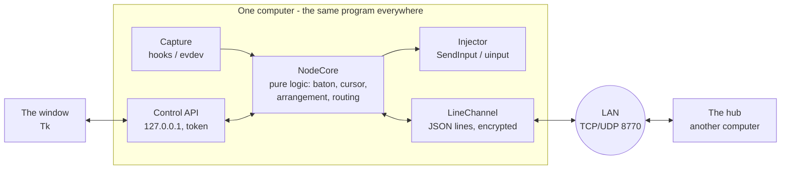
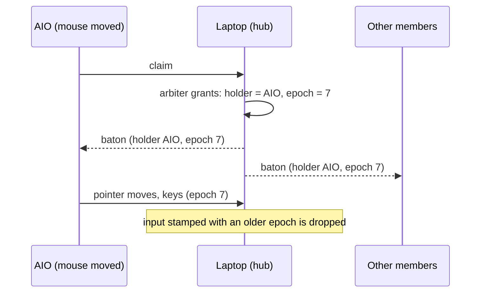
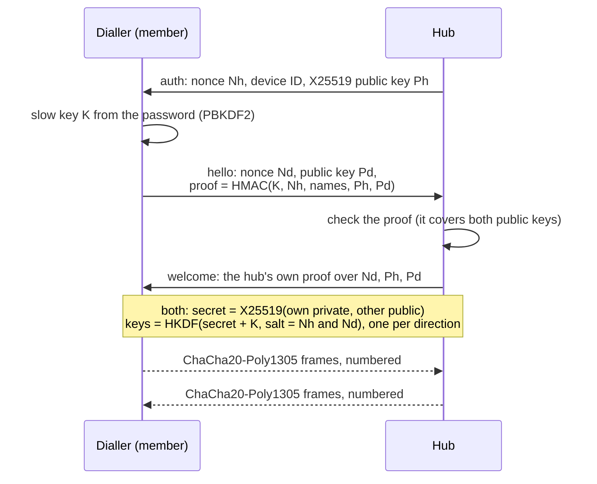
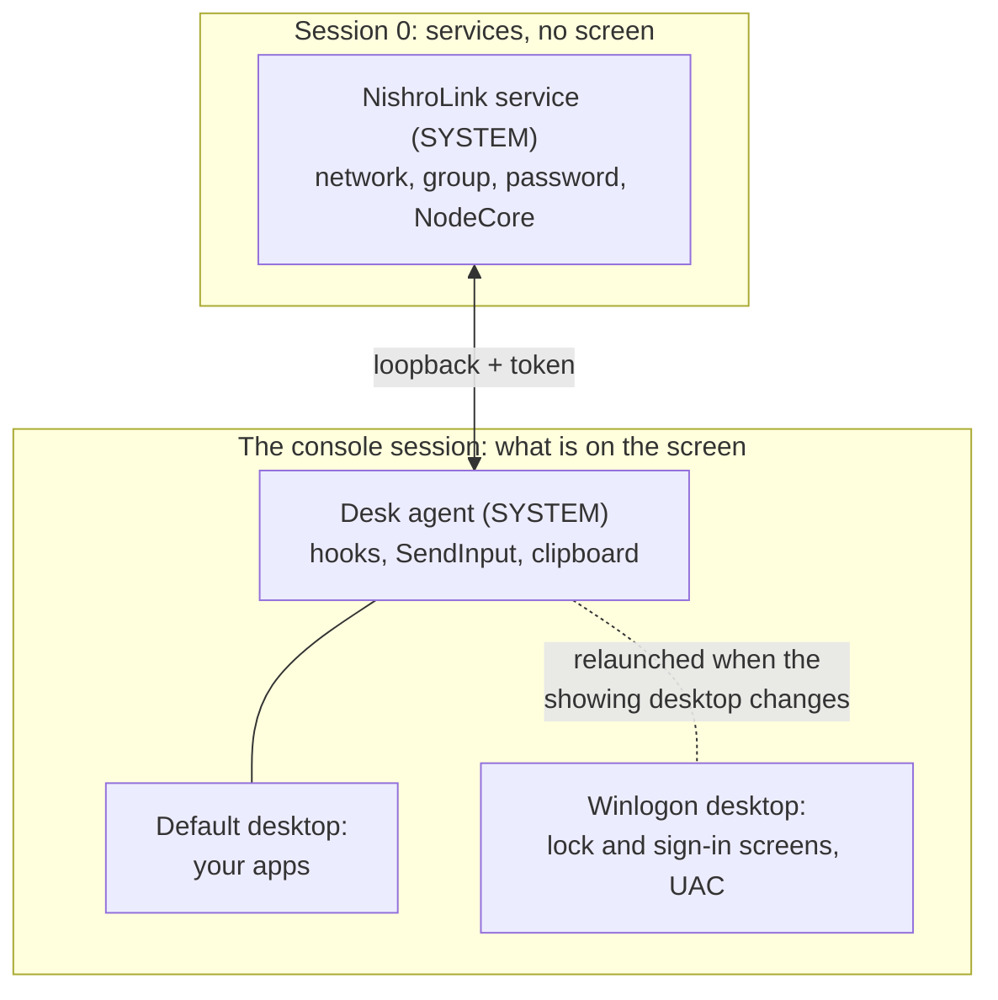

# Design decisions

**Why Nishro Link is built the way it is.** Every major choice in the project:
what was chosen, what else was considered, why, and what it costs. Each section
ends with **In one sentence**, the short answer to "why did you do it that way?".

[DESIGN.md](../link/DESIGN.md) is the full technical specification; this page
is the reasoning behind it. The last two sections are
[bugs that taught something](#23-bugs-that-taught-something) and
[quick answers](#25-quick-answers) for the questions people ask most.

---

## Contents

1. [The problem and its constraints](#1-the-problem-and-its-constraints)
2. [The architecture in one picture](#2-the-architecture-in-one-picture)
3. [Peers with a hub, not a server and clients](#3-peers-with-a-hub-not-a-server-and-clients)
4. [The baton and epochs](#4-the-baton-and-epochs)
5. [The keyboard follows the pointer, not control](#5-the-keyboard-follows-the-pointer-not-control)
6. [Safety properties before features](#6-safety-properties-before-features)
7. [The wire protocol: JSON lines over TCP](#7-the-wire-protocol-json-lines-over-tcp)
8. [Finding devices by name](#8-finding-devices-by-name)
9. [Passwords: generated words, a slow key](#9-passwords-generated-words-a-slow-key)
10. [Encryption: X25519, HKDF, ChaCha20-Poly1305](#10-encryption-x25519-hkdf-chacha20-poly1305)
11. [Adding a device: the group password, sealed twice](#11-adding-a-device-the-group-password-sealed-twice)
12. [Capturing and playing input on each system](#12-capturing-and-playing-input-on-each-system)
13. [A system service, and on Windows a desk agent](#13-a-system-service-and-on-windows-a-desk-agent)
14. [The window is only a client](#14-the-window-is-only-a-client)
15. [The arrangement: rectangles compiled into doors](#15-the-arrangement-rectangles-compiled-into-doors)
16. [The clipboard: announce, then fetch](#16-the-clipboard-announce-then-fetch)
17. [Finding the pointer: what counts as a shake](#17-finding-the-pointer-what-counts-as-a-shake)
18. [Latency: where it really came from](#18-latency-where-it-really-came-from)
19. [Why Python, and why Tk](#19-why-python-and-why-tk)
20. [Packaging and releases](#20-packaging-and-releases)
21. [Testing](#21-testing)
22. [Versions and compatibility](#22-versions-and-compatibility)
23. [Bugs that taught something](#23-bugs-that-taught-something)
24. [Known limits, and what would come next](#24-known-limits-and-what-would-come-next)
25. [Quick answers](#25-quick-answers)

---

## 1. The problem and its constraints

A desk with a Windows laptop and an Ubuntu desktop, each with its own keyboard
and mouse. The goal: **one set of hands for both**, the way a hardware KVM
switch or Synergy works, with these constraints:

| Constraint | Consequence |
|---|---|
| **Windows and Linux**, including **Wayland** | Wayland forbids one program reading or moving another's input, so the X11 tricks older tools use are out. |
| **Whichever mouse is in reach drives** | No fixed "server" computer: every computer must be able to capture *and* inject. |
| **Works at the login and lock screens** | Must run before anyone logs in: a system service, not a user app. |
| **Local network only, no accounts, no cloud** | Devices find and trust each other on the network by themselves. |
| **Carries passwords typed on another computer** | Encryption and authentication are not optional. |
| **Runs on a low-power Celeron all-in-one** | Light on CPU and memory; no heavy runtime. |
| **Never leaves a computer unusable** | Every failure must end with each computer having its own mouse and keyboard back. |

**In one sentence:** a software KVM for mixed Windows and Wayland desks, where
any computer's mouse can drive, that works from boot and fails safe.

---

## 2. The architecture in one picture

Every computer runs the same program. Inside it, the logic that decides things
is kept apart from everything that touches the operating system:



- **NodeCore** is pure: input events and messages go in, *actions* come out
  (send this, inject that). It never touches a socket or a device, so all of its
  behaviour is testable on any machine.
- **Node** is the shell around it: sockets, threads, the capture and the
  injector.
- The **window** is a separate client over a local HTTP API ([§14](#14-the-window-is-only-a-client)).

**In one sentence:** a pure decision core wrapped in a thin OS shell, the same
program on every computer, with the window as a separate client.

---

## 3. Peers with a hub, not a server and clients

**Decision.** Every computer is an equal *node*. One of them is the **hub**:
the others connect to it, it relays between them, and it alone decides who is
in control. That is an administrative role only; the hub's mouse has no
privilege.

| Option | Why not |
|---|---|
| **Server and clients** (Synergy, Barrier, Input Leap) | Only the server's keyboard and mouse are shared. Here, whichever mouse is in reach must drive. |
| **Full mesh, every pair connected** | *n²* connections and *n²* things to keep in sync, with no one to settle a tie. |
| **Distributed agreement** (a consensus protocol) | Correct, but vastly more complex than a few computers on one desk need. |
| **One arbiter: the hub** ✔ | Every claim goes to one place, so two computers can never both believe they are driving. |

**The cost:** if the hub is off, nobody can drive. That is made safe, not
hidden: with no hub, every computer simply keeps its own mouse and keyboard,
like a normal PC. Any computer can be the hub; a group of one is its own hub.

**In one sentence:** a single arbiter makes "two computers both driving"
impossible rather than unlikely, and the only cost, a hub that is off, fails
back to normal PCs.

---

## 4. The baton and epochs

**Decision.** Control is a **baton**. A computer whose mouse moves asks the hub
for it; the hub grants it and tells everyone. Every grant has an **epoch**, a
number that goes up by one each time, and every input message carries the epoch
it was sent under.



**Why epochs:** after a handover, messages from the previous holder may still
be in flight. Without an epoch, a late "pointer moved" from the old holder would
yank the pointer back. With one, anything stamped with an old epoch is simply
discarded. It is the same idea as a fencing token in distributed locks.

**Why a claim needs a *deliberate* movement** (8 pixels within 300 ms, or a
click if you choose): a desk gets bumped. A twitch must not steal control.

**The watchdog:** suppressing a computer's own mouse is only allowed while the
baton is *live*: heard from within 1.5 s, with keep-alives every 0.4 s. A
silent holder, such as a crashed program or a dead link, means every computer
takes its own input back.

**In one sentence:** one hub-granted baton with a rising epoch, so stale input
from a previous holder can never move the pointer, and a watchdog so a silent
holder can never freeze anyone.

---

## 5. The keyboard follows the pointer, not control

**Decision.** Keys go to the computer whose **screen the pointer is on**, not to
the computer whose mouse is driving.

Driving from the AIO with the pointer on the laptop's screen, you are
*looking* at the laptop. Your keys must go there. This is also what makes a
keyboard on one computer useful with the pointer on another, whichever mouse
moved it.

**In one sentence:** you type where you are looking, and you are looking where
the pointer is.

---

## 6. Safety properties before features

A program that grabs every keyboard and mouse can lock someone out of their own
computer. So the design starts from promises, not features
([DESIGN.md §4](../link/DESIGN.md#4-safety-properties)):

| | Promise | How |
|---|---|---|
| **P1** | The physical mouse never freezes. | Nothing on the input-hook thread may block. Hooks only queue; everything else happens on other threads. On Windows a slow low-level hook freezes the pointer for the *whole* computer. |
| **P2** | Suppression requires a live baton. | The watchdog above. |
| **P2b** | You always get your machine back. | **Both Ctrl keys** release everything, on every computer, handled at the capture layer where nothing else can intercept it. |
| **P3** | No key stays down. | Every key and button pressed on a computer's behalf is tracked and released on any handover, disconnect or doubt. |
| **P4** | Fail open. | An error while handling an event passes the event through rather than swallowing it. |
| **P5** | Nothing is injected from an unauthenticated peer. | Input is played only after both sides have proved the password. |
| **P6** | Injected input is never mistaken for local input. | Windows marks injected events with a flag; on Linux our own virtual device is skipped by name. Otherwise two computers would ping-pong control forever at wire speed. |

**In one sentence:** the failure modes of an input-grabbing program are severe,
so safety properties came first and every feature has to keep them.

---

## 7. The wire protocol: JSON lines over TCP

**Decision.** One JSON object per line, over one TCP connection per peer.

| Option | Why not |
|---|---|
| **A binary format** (Protocol Buffers, MessagePack) | Input is tiny, about 1 KB/s while moving. A dependency and an unreadable wire buy nothing measurable. |
| **UDP for the pointer** | Loss and reordering would need their own handling, and keys must *never* be lost or reordered. On a LAN, TCP's latency is not the bottleneck ([§18](#18-latency-where-it-really-came-from)). |
| **JSON lines on TCP** ✔ | In the standard library; readable in a debugger or `nc` at 2 a.m.; TCP gives order and reliability for free. |

**What makes TCP quick enough:**

- **TCP_NODELAY**: no waiting to fill packets.
- **Batching:** whatever is queued goes out in one write, one packet.
- **Collapsing:** a pointer position superseded by a newer one before it was
  sent is dropped, since positions are absolute and only the newest matters.
  Nothing else is merged or reordered.
- **A bounded queue** that keeps the *newest* events, so a slow link shows up
  as a skipped frame, never as a pointer trailing seconds behind.

**Guard rails:** a line longer than 128 KiB closes the connection, because a
peer that never sends a newline must not grow memory forever. The protocol
version is checked on the first message, so a mismatch is a clear refusal
instead of a confusing failure three messages later.

**In one sentence:** readable JSON lines over TCP, made fast with no-delay,
batching and collapsing of superseded pointer positions, because the traffic is
tiny and correctness of key order matters more than bytes.

---

## 8. Finding devices by name

**Decision.** No IP addresses anywhere. A device is found by **name** with a
small UDP question broadcast on the LAN (and to a multicast group,
`239.255.87.70`), on the **same port** as the link, 8770.

| Option | Why not |
|---|---|
| **Type an IP address** | Addresses change with DHCP, and people should not need to know them. |
| **mDNS / Bonjour / Avahi** | Another dependency and service; Windows support is uneven; another firewall rule. |
| **ARP or ping sweeps** | They say a machine exists, not what it is called or whether it runs Nishro Link. |
| **A tiny broadcast "who is *name*?"** ✔ | Standard library only; one port, so one firewall rule covers everything. |

**Details that matter:**

- A pairing remembers the peer's permanent **device ID** and its last address.
  Dialling tries the remembered address first; if it fails, or reaches a
  *different* device (the address went to another machine), it searches again.
- **Answers are not trusted.** Anything on the network can claim to be "aio".
  That is fine: the handshake still demands the password, and a fake gets
  nothing it can use ([§9](#9-passwords-generated-words-a-slow-key)).
- Questions are sent **from port 8770** so the answer comes back to 8770. A
  Linux firewall drops an answer to a random port because it cannot match it to
  a question sent to a broadcast address.

**In one sentence:** a one-packet "who is *name*?" on the link's own port:
no dependencies, one firewall rule, and the answer is only a hint because
authentication happens afterwards.

---

## 9. Passwords: generated words, a slow key

**Decision.** Every device **generates** its password: four words from the
EFF short word list (1,239 words), such as `tiger-lemon-coral-radio`, about
41 bits. What devices prove to each other is not the password but a **slow key**
made from it: **PBKDF2-SHA256, 2¹⁹ rounds**, salted with the hub's device ID.

Why each piece:

- **Generated, not chosen:** people choose weak passwords, and this one matters
  (it guards keystrokes).
- **Words, not random characters:** it is read off one screen and typed on
  another. Words are easy to read, say and type. Capitals, spaces and dashes are
  ignored.
- **A slow key:** anyone who records a handshake can try guesses offline. Each
  guess costs 2¹⁹ hashes, so 41 bits of password become about **60 bits of
  work**, more than the 12 random characters it replaced. It costs half a second,
  once per password, on the slowest machine, and is then cached.
- **Salted with the hub's device ID:** a table precomputed for one group is
  useless against another.
- **PBKDF2 rather than scrypt or Argon2:** it is in Python's standard library
  everywhere, back to Python 3.8, with nothing to compile.

**The honest limit:** a **PAKE** (a password-authenticated key exchange such as
SPAKE2 or OPAQUE) would stop offline guessing entirely: a recorded handshake
would reveal nothing to guess against. None is available in a vetted, widely
packaged Python library, and a home-made one is exactly what not to ship. It is
the first thing on the security wish-list.

**In one sentence:** generated four-word passwords, readable across a desk,
stretched with 2¹⁹ rounds of PBKDF2 to about 60 bits of work per offline
guess; a PAKE would be better and is the next step.

---

## 10. Encryption: X25519, HKDF, ChaCha20-Poly1305

**Decision.** Every connection runs an **ephemeral X25519** key exchange inside
the password handshake. Session keys come from **HKDF-SHA256** over the X25519
secret *and* the password key. Every frame after the handshake is sealed with
**ChaCha20-Poly1305**. All three come from the **`cryptography`** library, the
same primitives WireGuard and TLS 1.3 use.



**Why each primitive:**

| Choice | Why |
|---|---|
| **X25519** | Fast, constant-time, no invalid-curve pitfalls. **Ephemeral** keys, thrown away with the connection, give **forward secrecy**: traffic recorded today stays secret even if the password leaks tomorrow. Keys that would make an all-zero secret are refused. |
| **Binding both public keys into the password proofs** | A machine in the middle cannot swap in its own keys without remaking a proof, which needs the password. This is what turns a plain Diffie-Hellman into an *authenticated* one. |
| **HKDF over the X25519 secret *and* the password key** | The session keys need *both*: an attacker has to break the exchange *and* know the password. |
| **ChaCha20-Poly1305** | An authenticated cipher: confidentiality and tamper detection in one. Fast in software on every CPU, including low-power ones, with no timing side channels. It is WireGuard's cipher. |
| **Frame numbers as nonces, never sent** | TCP delivers in order, so both ends count. A dropped, replayed, reordered or altered frame fails authentication and ends the connection. |
| **One key per direction** | A frame can never be reflected back to its sender as if it were the other side's. |

**Why not TLS?** Python's own TLS cannot key a connection from a shared password
before Python 3.13, and the alternative, certificates, means either a certificate
authority or "trust this fingerprint?" prompts. Pairing by name and password is
the whole user experience, so the handshake is password-authenticated from the
start.

**Why not the Noise framework?** The handshake is essentially a Noise-style
pattern with a pre-shared key, but there is no widely packaged, maintained
Python Noise library; composing the same standard primitives from
`cryptography` directly is smaller and easier to audit.

**A lesson built in.** An earlier version sealed frames with a keystream built
from BLAKE2 hashes: standard pieces, assembled at home. It was replaced before
the first public release, because anyone reviewing a program that carries
keystrokes should find standard constructions from a vetted library.

**In one sentence:** an ephemeral X25519 exchange bound into mutual password
proofs, keys from HKDF over both the exchange and the password, and
ChaCha20-Poly1305 on every numbered frame, which gives authentication, forward
secrecy, and replay and tamper detection, all from a vetted library.

---

## 11. Adding a device: the group password, sealed twice

When a computer adds another, it has to hand over the **group's** hub and
password. That happens inside a connection authenticated with the **new
device's** own password (which the person just typed), encrypted like every
other link. Inside it, the group password is **sealed a second time** under the
new device's password key (ChaCha20-Poly1305, key from HKDF over that key and
two fresh nonces).

- The group password **never** crosses the network in the clear, not even
  inside an otherwise encrypted link.
- A computer that already has devices of its own **cannot join** another group:
  its devices would be stranded. It can only add.
- Removing a device gives it a group of its own with a **new** password; the
  hub refuses its ID until it is deliberately added again.

**In one sentence:** the group password travels only inside a connection
authenticated by the new device's own password, and is sealed again inside it.

---

## 12. Capturing and playing input on each system

| | Windows | Linux |
|---|---|---|
| **Reading input** | Low-level hooks (`WH_MOUSE_LL`, `WH_KEYBOARD_LL`) | **evdev**: reading `/dev/input/*` directly |
| **Swallowing input** (while it goes elsewhere) | The hook returns "handled" | `EVIOCGRAB`: an exclusive grab of the device |
| **Playing input** | `SendInput` / `keybd_event` | **uinput**: a virtual keyboard and mouse the kernel treats as real |
| **Telling our own input apart** (P6) | The `INJECTED` flag Windows sets | Our virtual device's name |

**Why hooks on Windows, not Raw Input:** Raw Input can *read* but not *stop*
input. When the pointer is on another computer, the local mouse must not also
move the local pointer.

**Why evdev and uinput on Linux, not X11 or portals:**

| Option | Why not |
|---|---|
| **X11 (XTest, XInput)** | Does not exist on Wayland, and Wayland is the default on Ubuntu. |
| **Desktop portals and libei** | The modern, sandbox-friendly way, but: a permission prompt, desktop-specific support that arrived only in recent releases, and **nothing at the login screen**. |
| **evdev + uinput** ✔ | Works identically on Wayland, X11, GNOME, KDE, the login screen and the lock screen, back to old distributions. |

**The cost, stated plainly:** reading every input device needs membership of
the `input` group, whose members can read every keyboard. It is the same power
any tool of this kind needs; the package adds only the person installing it,
and the security page says so.

One more detail learned the hard way: devices are **re-scanned every two
seconds**, so a keyboard that connects after start-up (a wireless one waking,
a Bluetooth one after login) is picked up ([§23](#23-bugs-that-taught-something)).

**In one sentence:** low-level hooks and SendInput on Windows; evdev with a
grab and uinput on Linux, because that is the one mechanism that works the
same on Wayland, X11 and the login screen, at the price of the `input` group.

---

## 13. A system service, and on Windows a desk agent

**Decision.** Nishro Link runs as a **system service** on both systems, so it
works before anyone logs in. On Windows that needs a second, small process.



**Why:** on Windows a service lives in session 0, which has no screen, and the
lock and sign-in screens are on a separate, protected desktop that ordinary
programs cannot touch. The service therefore starts a tiny **desk agent**, as
SYSTEM, in the console session, **on whichever desktop is showing**. When that
changes (you lock the screen, a UAC prompt appears), the agent reports it and
exits; the service starts a new one there. The network link never drops.

On **Linux** the service runs as root and reads and plays input at the device
level, which works at the login screen as it is. Only the clipboard needs the
user's session; it is reached by running `wl-copy`/`xclip` *as that user*,
with their session's environment.

**In one sentence:** a system service so it works before login; on Windows it
drives a small agent that follows whichever desktop is showing, because the
lock screen lives on a desktop a service cannot reach directly.

---

## 14. The window is only a client

**Decision.** The window (Tk) talks to the service over **HTTP on 127.0.0.1**,
with a random **token** the service writes to a small file (`api.json`).

- Closing or crashing the window changes nothing: sharing goes on.
- The same API serves the window, a web page and the tests.
- Only processes that can read the token file can use it. On Linux that is
  root and the `input` group; on Windows it is every local account (a known
  limitation, documented in [security](security.md#who-is-trusted)).

**In one sentence:** the engine is a service and the window a replaceable
client over a token-protected local API, so the UI can never take the link
down with it.

---

## 15. The arrangement: rectangles compiled into doors

**Decision.** The arrangement is **rectangles on a plane**, one group of
rectangles per computer (its monitors), the way operating systems lay out
their own monitors. Whenever it changes, it is **compiled** into a list of
**doors**: every stretch of edge where one screen touches another.

```
   ┌──────────────┐┌──────────────┐
   │   laptop     ││   desktop    │      the shared edge is a door:
   │              ║║              │      leaving the laptop's right edge at
   │              ║║              │      height t arrives on the desktop's
   └──────────────┘└──────────────┘      left edge at the matching height
```

- The pointer moves in each computer's **own pixels** and changes computer
  **only through a door**. So the size a box is *drawn* at never changes how fast
  the pointer moves; resizing a box only changes where its borders meet.
- Positions along a door map with **integer arithmetic**
  (`c + ((2(t−a)+1)(d−c)) // (2(b−a))`): no floating-point drift, and every
  pixel on one side lands on a pixel on the other.
- **Copies** of a computer are just more rectangles whose doors lead back to
  it: that is all wrap-around is.
- A placement that is impossible (overlapping screens, a door leading to two
  places, an absurd size) is **refused as a whole**, and the editor says why
  in words.

**In one sentence:** screens are rectangles, the arrangement compiles to doors
where they touch, and the pointer moves in native pixels through doors with
integer maths, which is why resizing never changes speed and wrap-around is
just another door.

---

## 16. The clipboard: announce, then fetch

**Decision.** Copying announces *that* something was copied (a small message);
the data moves only when another computer actually **pastes**, in chunks, up to
1 MiB of text.

- Nothing large is pushed around on every copy.
- On Windows a clipboard *sequence number* makes "has it changed?" a function
  call instead of reading the clipboard twice a second.
- On Linux under Wayland it works through `wl-copy`/`wl-paste`, in the logged-in
  user's session.

**In one sentence:** lazy clipboard sharing, announce on copy and fetch on
paste, so copying costs nothing until someone pastes.

---

## 17. Finding the pointer: what counts as a shake

Movement is gathered into 25 ms slices and judged over the last 800 ms. It
counts as a shake when **all** of these hold:

- it went **a long way**, at least 800 pixels in total;
- it **doubled back sharply** at least 4 times, the direction swinging round by
  more than 120° from one slice to the next;
- it went at least **3 times further than the size of the patch** it stayed in.

**Why not just speed?** A fast straight drag is fast; a fast circle turns
constantly. Neither is a shake. Sharp reversals separate a shake from a circle,
and "went far but got nowhere" separates it from a zig-zag across the screen.
Then nothing for 1.5 s, so one shake is one spotlight.

The spotlight shows on **whichever computer the pointer is on**: the computer
that saw the shake asks that one to show it. Windows draws a layered window;
GNOME's own *Locate Pointer* ripple is used on Linux.

**In one sentence:** a shake is long travel, repeated sharp reversals and
little net displacement, which is testable and not fooled by fast drags or
circles.

---

## 18. Latency: where it really came from

The pointer sometimes felt laggy on Wi-Fi. **Measured before optimising:** the
program's own handling of an event took about **0.3 ms**. The delay was the
**Wi-Fi radio of the computer being controlled going to sleep** between packets
(power saving), then taking tens of milliseconds to wake.

**Fixes, in order of effect:**

1. **Keep the radio awake:** while a computer is being controlled, a tiny
   message goes to it every **40 ms**, so its radio never dozes off.
2. **Batch and collapse** in the sender ([§7](#7-the-wire-protocol-json-lines-over-tcp)).
3. A **shorter thread switch interval** in Python, so the reader thread runs
   promptly.

**In one sentence:** measurement showed the lag was Wi-Fi power saving, not
the code, so the fix was a 40 ms keep-awake while controlled, plus batching,
not micro-optimising.

---

## 19. Why Python, and why Tk

| Choice | Why | Cost |
|---|---|---|
| **Python** | One readable codebase on both systems; standard library covers sockets, JSON, hashing, HTTP and the UI; fast to change and to test. | Performance: fine at these rates (a mouse reports up to 1,000 times a second; handling takes about 0.3 ms). Packaging: solved with PyInstaller on Windows and the system Python on Linux. |
| **Tkinter** | In the standard library on both systems, tiny, starts quickly on a low-power machine; the Sun Valley theme gives Windows 11-style controls. | Less capable than Qt; custom widgets (switches, menus drawn on a canvas) were written where needed. |
| **Minimum Python 3.8** | Covers Ubuntu 20.04 and Debian 11 with their own Python; CI tests on those systems' real libraries. | No newer syntax (no `match`, no `dict \| dict`). |

**Why not Rust, Go or C#?** They would all do the core well. The deciding
factors were one codebase for two systems with no extra runtime on Linux,
direct access to OS APIs through `ctypes` on Windows and evdev on Linux, and
speed of iteration. The measured hot path leaves no reason to change.

**In one sentence:** Python and Tk because both come with every target system,
the hot path is measured at a fraction of a millisecond, and one small readable
codebase beats marginal speed.

---

## 20. Packaging and releases

| | How | Why |
|---|---|---|
| **Windows** | PyInstaller **one-file exe**, inside an **Inno Setup** wizard | No Python needed on the target. The wizard installs the service, the firewall rule and the Start Menu entry, and uninstalls cleanly. |
| **Linux** | A **`.deb` built by a pure-Python script** | Builds anywhere (even on Windows), reproducibly, and checks itself: file modes, line endings, control fields. Dependencies come from the system via `apt`. |
| **No Flatpak or Snap** | | Their sandboxes exist to prevent exactly what this program must do: read all input, create a virtual device, run from boot. Packaged there, it would need so many holes that the sandbox would only look like protection. |
| **Releases** | Built by **GitHub Actions from a tag**, with `SHA256SUMS` | Nothing published is built on anyone's own computer, and every file can be verified. |

**In one sentence:** a one-file exe in a real installer, a self-checking `.deb`,
no sandboxed formats because they cannot honestly host an input tool, and
releases built only by CI from tags.

---

## 21. Testing

About **1,260 tests**, run on every change by CI on Windows (Python 3.8, 3.11,
3.12), Linux (3.10, 3.12, 3.14), and inside real **Ubuntu 20.04** and
**Debian 11** with their own Python and libraries; plus the `.deb` installed on
five systems.

- **The pure core is tested directly:** events in, actions out. No devices, no
  sockets.
- **Live tests** run real nodes over loopback sockets, with the mouse, keyboard
  and screen faked: handshakes, handovers, groups of three, encryption on the
  wire (a tap in the middle checks that no key press is readable).
- **Fuzzing** of the arrangement engine against an older engine, plus junk input.
- **Filmed checks** during development: popups recorded frame by frame and
  measured, to find flicker (the Details window went from 60% of its area
  redrawn to none); the behaviour behind each fix is then pinned by a test.
- **The test never touches the real network or real input.**

Running on old systems and several Python versions paid for itself at once:
it found a Python 3.9-only line that broke reconnection on 3.8, and three
Linux-only bugs in the first Linux run ([§23](#23-bugs-that-taught-something)).

**In one sentence:** a pure core tested directly, real nodes over loopback,
fuzzing, filmed UI checks, and a CI matrix across systems and Python versions
that has already caught real bugs.

---

## 22. Versions and compatibility

**Rule:** **every 1.x works with every other 1.x.** A 1.x release may *add*
messages or fields (older versions ignore what they don't know), but never
change the meaning of existing ones. Anything else is 2.0.

The **protocol version** (8 in 1.x) is separate from the app version and
checked on the first message: a mismatch is refused with a clear message. The
0.x betas changed the protocol freely; 1.0 is where that stopped.

**In one sentence:** semantic versioning with a protocol that only grows within
a major version, so computers can be updated one at a time.

---

## 23. Bugs that taught something

Real bugs, each now covered by a test. Good material for "tell me about a hard
bug".

| Bug | Cause | Lesson |
|---|---|---|
| **Two computers took control from each other forever** | When one computer moved the pointer on the other's screen, nothing told the capture there. The next one-pixel twitch was measured from the old position, hundreds of pixels away, looked like a deliberate move, and claimed control. Two computers did it to each other endlessly. | Every position you set yourself must be fed back to whatever measures movement. |
| **Control jumped back to a computer nobody touched** | A claim sent just before a handover was granted just after it. | Claims and grants need a notion of time: the epoch. |
| **An idle holder looked like a dead link** | The watchdog was fed only by input, and keep-alives ran slower than its timeout. | A liveness signal must be faster than the timeout it feeds: 0.4 s against 1.5 s. |
| **Typing on the Linux computer did nothing across** | Input devices were opened once, at start; the keyboard had re-appeared after. | Hardware comes and goes: rescan. |
| **On Python 3.8, a renamed device could never reconnect** | One line merged dicts with `\|`, a 3.9 feature; static checkers cannot see it. | Test on the oldest version you claim, with its real libraries. |
| **Two copies could both answer on the discovery port** | `SO_REUSEADDR` means "reuse after close" for TCP on Linux, but "share this port" for UDP. | The same socket option means different things per protocol and per OS. |
| **A restart said "another copy is running" when none was** | On Linux, closing a socket another thread is blocked in `accept()` on neither wakes it nor frees the port. | `shutdown()` before `close()`. |
| **Reconnecting timed out again and again on a slow machine** | 2 s for a handshake in which the hub first derives a deliberately slow key. | Deliberately slow crypto needs timeouts sized for the slowest hardware. |
| **The Details window flickered** | Its "has anything changed?" check included the round-trip time, which changes every poll. | Separate values that update in place from structure that needs a rebuild. |
| **The installer said the service failed when it hadn't** | Its clean-up killed the one-file exe's own launcher process. | Know your packaging's process tree. |

---

## 24. Known limits, and what would come next

**Limits today** (all documented):

- Offline guessing of the password from a recorded handshake is possible, if
  expensive (about 2⁶⁰ work) → a **PAKE** would remove it.
- On Windows, any local account can use the control API → narrow `api.json`'s
  permissions to the signed-in user.
- Clipboard is text only; no file transfer.
- On Linux, a monitor change needs a restart for the pointer's new size.
- The Windows installer is not code-signed; the code is not independently
  audited.

**Next, roughly in order:** images and files over the clipboard; monitor
changes on Linux without a restart; *Find the pointer* on KDE; a PAKE; a signed
installer; tighter local access on Windows.

---

## 25. Quick answers

**What is it?** A software KVM: one keyboard and mouse across Windows and Linux
computers. Push the pointer off one screen onto the next; keys follow the
pointer; copy on one, paste on another.

**What's different from Synergy or Input Leap?** Any computer's mouse can drive,
not just a server's; it works on Wayland without prompts and at the login and
lock screens; you pair by name and a four-word password, with no IP addresses
or certificates; and the arrangement is free-form, with resizable borders and
wrap-around.

**How does it stop two computers fighting over the pointer?** One hub arbitrates
a baton; every grant has an epoch, and stale input is dropped.

**How is it secured?** Mutual password proofs over an ephemeral X25519 exchange,
with both public keys bound into the proofs; HKDF keys from the exchange and the
password; ChaCha20-Poly1305 on every numbered frame. The result is forward
secrecy and replay, reorder and tamper detection, all from the `cryptography`
library.

**Why not TLS?** Python's TLS can't do password-keyed connections before 3.13,
and certificates would mean a CA or trust prompts. The whole experience is
"type the password".

**What's the weakest point?** Offline guessing from a recorded handshake: about
2⁶⁰ work thanks to 2¹⁹ PBKDF2 rounds, but a PAKE would close it.

**How does it work on Wayland?** It works below the compositor: evdev to read,
uinput to play. It needs the `input` group.

**How does it work on the Windows lock screen?** A SYSTEM service plus a desk
agent that follows whichever desktop is showing, including the secure Winlogon
desktop.

**Why TCP and JSON?** The traffic is tiny, order and reliability matter for keys,
and readability matters for debugging. It is made fast with no-delay, batching and
dropping of superseded pointer positions.

**Why Python?** One codebase for both systems, everything in the standard library,
and a measured 0.3 ms per event.

**How do you know it's reliable?** Safety properties first (never freeze the
mouse, always give the machine back, no stuck keys), about 1,260 tests, and CI
across Windows, three Linux Python versions and old distributions with their
own libraries.

**What would you do differently?** Start with a PAKE; build the protocol's
extension points (optional fields, capability flags) in from day one; test the
oldest supported Python from the first commit.
