# Nishro Link user manual

**Version 1.1** · for Windows 10/11 and Linux (Ubuntu, Debian and others)

Nishro Link lets one mouse and keyboard work several computers. Push the pointer
off the edge of one screen and it appears on the next computer's; type, and the
keys go to whichever screen the pointer is on; copy text on one computer and
paste it on another.

This manual covers every part of the program, step by step. The pictures show
the dark theme; the light theme has the same layout. The numbered amber circles
in the pictures match the numbered notes under them.

---

## Contents

1. [How it works, in one page](#1-how-it-works-in-one-page)
2. [What you need](#2-what-you-need)
3. [Installing on Windows](#3-installing-on-windows)
4. [Installing on Linux](#4-installing-on-linux)
5. [The window at a glance](#5-the-window-at-a-glance)
6. [Connecting your computers](#6-connecting-your-computers)
7. [Arranging your screens](#7-arranging-your-screens)
8. [Wrap-around: copies of a computer](#8-wrap-around-copies-of-a-computer)
9. [Everyday use](#9-everyday-use)
10. [The tray icon and the dock](#10-the-tray-icon-and-the-dock)
11. [Finding the pointer](#11-finding-the-pointer)
12. [Getting your computer back](#12-getting-your-computer-back)
13. [Managing devices](#13-managing-devices)
14. [Settings](#14-settings)
15. [Activity and logs](#15-activity-and-logs)
16. [Help and About](#16-help-and-about)
17. [Keyboard shortcuts](#17-keyboard-shortcuts)
18. [Updating and uninstalling](#18-updating-and-uninstalling)
19. [When something is wrong](#19-when-something-is-wrong)
20. [Glossary](#20-glossary)

---

## 1. How it works, in one page

**Every computer runs Nishro Link.** Computers that work together form a
**group**. You build a group by adding one computer to another, using a
four-word password that each computer shows, such as `tiger-lemon-coral-radio`.

**One computer is the hub.** The others connect to it, and it decides which
computer is in control at any moment, so two can never fight over the pointer.
That is all it does: the hub's mouse is no more important than any other.

**Whichever mouse you move takes control.** You never have to "switch" to a
computer: pick up its mouse and it drives. The others follow.

**The keyboard follows the pointer.** Keys always go to the computer whose
screen the pointer is on.

**Where the screens are is up to you.** On the Arrangement page you place the
computers' screens the way they stand on your desk. The pointer crosses from one
screen to the next wherever two screens touch.

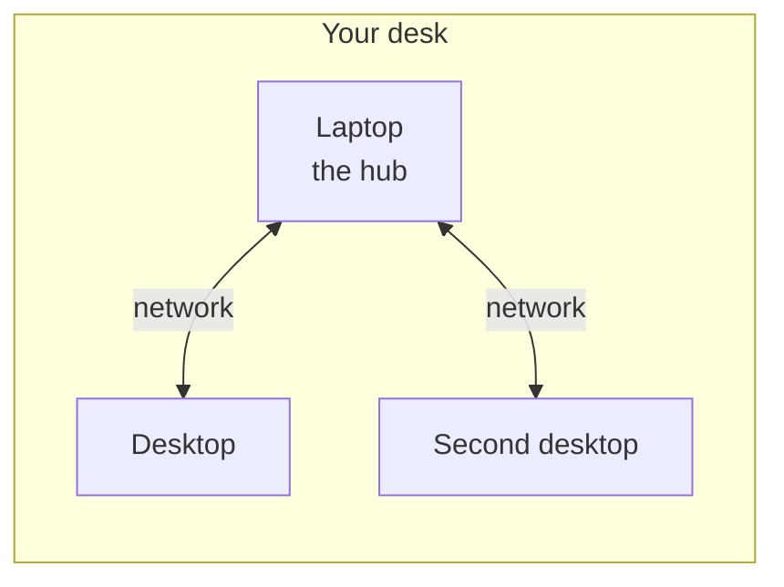
```mermaid
flowchart LR
    subgraph desk [Your desk]
        L[Laptop<br/>the hub] <-- network --> D1[Desktop]
        L <-- network --> D2[Second desktop]
    end
```

Everything travels over your own local network, encrypted. Nothing goes to the
internet.

---

## 2. What you need

| | |
|---|---|
| **Windows** | Windows 10 or 11, 64-bit. Administrator rights, once, to install. |
| **Linux** | Ubuntu 20.04 or later, Debian 11 or later, or a distribution based on them (the `.deb` package). Other distributions: from source, with Python 3.8 or later. Wayland and X11 both work. |
| **Network** | All computers on the same local network. TCP and UDP port **8770** allowed. |
| **Versions** | The same **major version** on every computer: any 1.x works with any other 1.x. |

The full list, with what has been tested, is in [requirements](requirements.md).

---

## 3. Installing on Windows

1. Download **`NishroLink-Setup-1.1.0.exe`** from the
   [releases page](https://github.com/nishro888/nishro-link/releases/latest).
2. Run it. Windows asks once for permission to make changes; choose **Yes**.

   > **"Windows protected your PC"?** The installer is not code-signed yet, so
   > SmartScreen may warn about it. Choose **More info**, then **Run anyway**.

3. **Accept the licence** (it is the MIT licence: free to use, copy and change)
   and choose **Next**.

   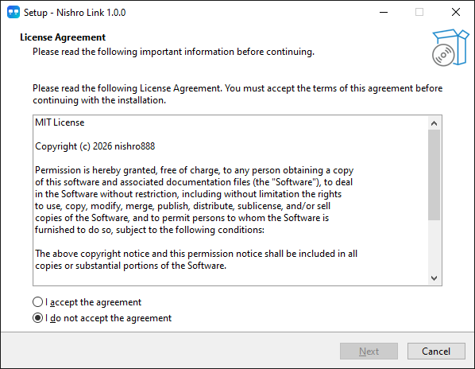

4. **Choose where to install.** The usual place is right for almost everyone.

   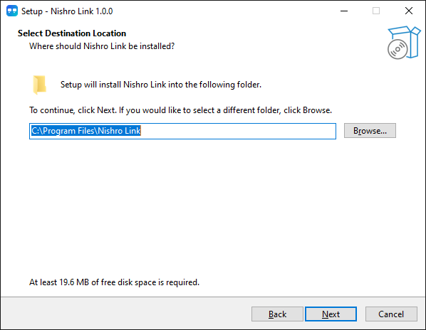

5. **Choose whether to add a desktop shortcut.** Nishro Link is in the Start
   Menu either way.

   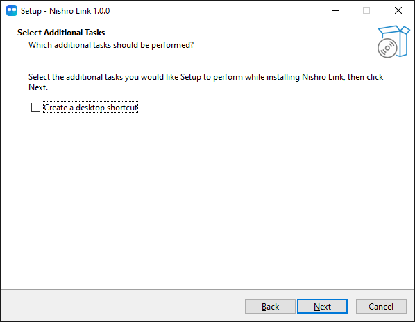

6. **Choose Install.**

   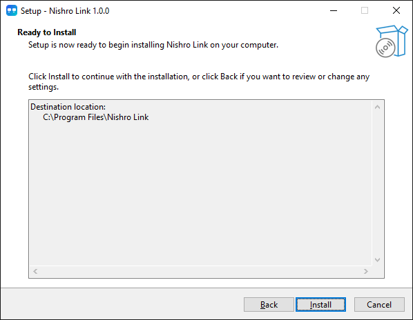

7. At the end, leave **Open Nishro Link** ticked and choose **Finish**.

**What the setup did:**

- installed the program to `C:\Program Files\Nishro Link`;
- set up a **background service** that starts with Windows. This is what lets
  another computer's mouse and keyboard work at the lock and sign-in screens;
- allowed Nishro Link through **Windows Firewall** on private and domain networks;
- added the **tray icon** by the clock, which starts whenever anyone signs in
  ([§10](#10-the-tray-icon-and-the-dock));
- added Nishro Link to the Start Menu, and to **Settings → Apps** for
  uninstalling.

The window is only a window onto the background service. **Closing it does not
stop sharing**; open it again from the Start Menu whenever you need it.

More detail: [install-windows.md](install-windows.md).

---

## 4. Installing on Linux

### Ubuntu, Debian, Linux Mint, Pop!_OS and others

1. Download **`nishro-link_1.1.0_all.deb`** from the
   [releases page](https://github.com/nishro888/nishro-link/releases/latest).
2. Install it. Either double-click it (Ubuntu's App Center opens and installs
   it), or in a terminal:

   ```bash
   sudo apt install ./nishro-link_1.1.0_all.deb
   ```

3. **Log out and back in once.** Nishro Link reads the keyboard and mouse
   directly, so your account has just been added to the `input` group, and that
   takes effect at your next login.
4. Open **Nishro Link** from the app menu. Its icon also appears in the top
   bar ([§10](#10-the-tray-icon-and-the-dock)).

**If you installed from the App Center**, the package cannot tell who you are,
so the window asks instead:

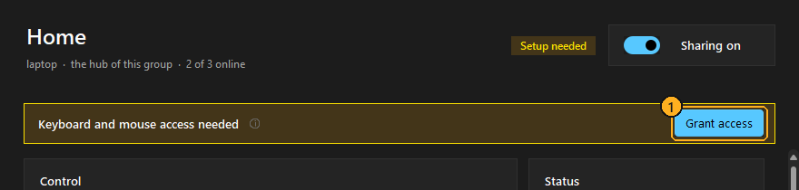

1. Choose **Grant access**. Ubuntu asks for your password; type it in its
   dialog.

Then the banner says what is left:

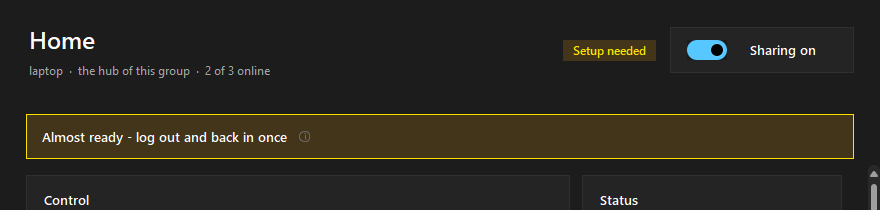

Log out and back in once, and the banner goes away.

**If a firewall is on** (Ubuntu's `ufw` is off unless you turned it on):

```bash
sudo ufw allow 8770
```

### Other distributions

Fedora, Arch and others install from source, for your own user. See
[install-linux.md → Other distributions](install-linux.md#other-distributions).

---

## 5. The window at a glance

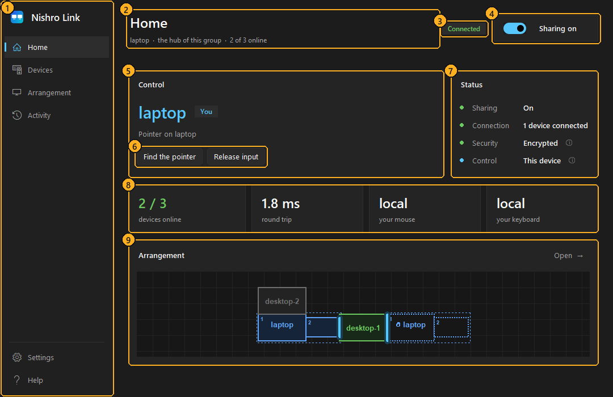

1. **Navigation.** The pages: **Home**, **Devices**, **Arrangement** and
   **Activity** at the top; **Settings** and **Help** at the foot, and under
   them **Quit** ([below](#quitting)).
2. **Where you are.** The page's name, and a line saying which computer this
   is, its role in the group, and how many devices are online.
3. **The status badge.** One word for the state of things:

   | Badge | Meaning |
   |---|---|
   | **Connected** | Linked to the group. |
   | **Ready** | On its own, waiting for a device to be added. |
   | **Waiting** | A hub whose devices are not connected yet. |
   | **Connecting** | Looking for its hub, or connecting to it. |
   | **Not connected** | Could not connect; the Devices page says why. |
   | **Paused** | Sharing is off on this computer. |
   | **Setup needed** | Linux: keyboard and mouse access is missing ([§4](#4-installing-on-linux)). |

4. **Sharing on / off.** Pauses everything on this computer without leaving
   the group ([§9](#9-everyday-use)).
5. **Control.** Which computer is in control right now: *You* when it is this
   one, and which screen the pointer is on.
6. **Find the pointer** and **Release input** ([§11](#11-finding-the-pointer),
   [§12](#12-getting-your-computer-back)).
7. **Status.** Sharing, connection, encryption and control, each with a
   coloured dot. Hover over **ⓘ** for more.
8. **At a glance:** devices online; the **round trip** (how long a message takes
   to reach the other computer and back; a few milliseconds is normal); and
   where *your* mouse and keyboard are going.
9. **Arrangement preview.** A small copy of the arrangement. **Open →** goes to
   the Arrangement page.

**On a narrow window** the navigation folds to icons; everything else stays
reachable:

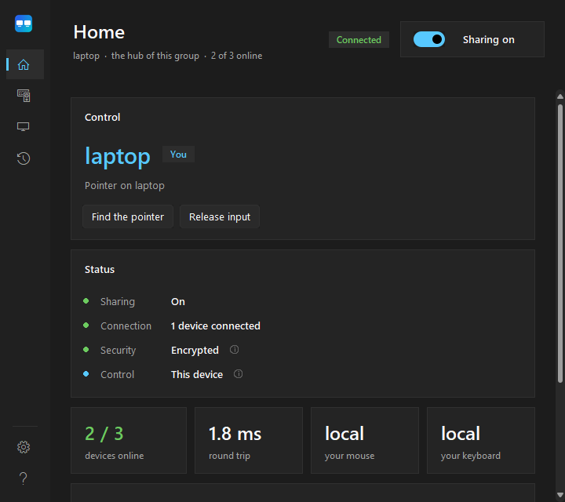

**Closing the window** (✕) never stops sharing when Nishro Link runs as a
service, which is how the installers set it up. When it runs without the service
(from source), closing asks whether to stop sharing and quit.

With the window closed, the **tray icon** keeps the everyday controls to hand
([§10](#10-the-tray-icon-and-the-dock)).

### Quitting

**Quit**, at the foot of the navigation or in the tray icon's menu, stops
Nishro Link completely: sharing stops on this computer, also at the sign-in
screen, and the tray icon and the window close. Open Nishro Link to start it
all again; restarting the computer does too. (To stop sharing for a while
without quitting, turn **Sharing** off instead: [§9](#9-everyday-use).)

On Windows no permission is asked. On Linux, recent systems (Ubuntu 24.04,
Debian 12 and later) don't ask either; older ones ask for your password to stop
and to start it.

---

## 6. Connecting your computers

Every computer starts in a **group of one**. To put two computers together, you
add one to the other, from **either** computer.

### Step 1: find the other computer's password

On the computer you want to add, open **Devices**. Under **This device** you see
its name and its **password**:

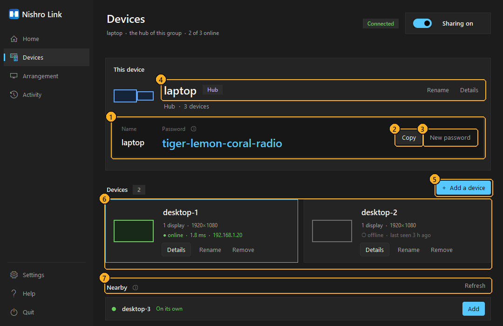

The password (callout **1**) is what you will type on the other computer. It is
four plain words, made up by Nishro Link. **Copy** (**2**) puts it on the
clipboard.

### Step 2: add it

On the **other** computer, open **Devices** and choose **+ Add a device**
(callout **5** above), or press **Ctrl+N**. The **Add a device** window lists
the computers it finds on your network:

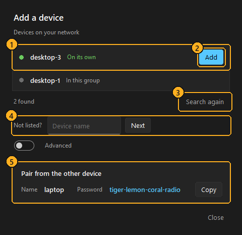

1. A computer found on the network, and what it is doing: **On its own** means
   it can be added.
2. **Add** starts adding it. A computer already in your group says **In this
   group** and has no button.
3. **Search again** looks once more, for example after starting Nishro Link on
   the other computer.
4. **Not listed?** Type the computer's name and choose **Next**. Turn on
   **Advanced** to type its network address as well, if searching is blocked on
   your network.
5. **Pair from the other device.** This computer's own name and password, for
   doing it the other way round.

### Step 3: type the password

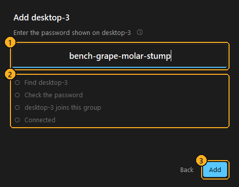

1. Type the password **shown on the other computer**. Capitals, spaces and
   dashes don't matter.
2. The steps it will go through.
3. Choose **Add** (or press **Enter**).

The window follows each step as it happens:

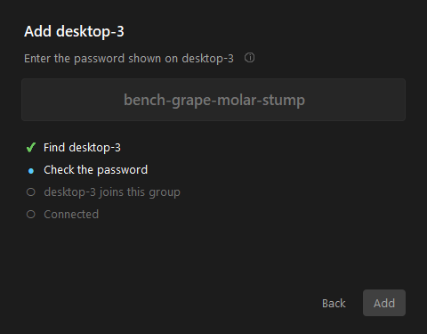

### Step 4: done

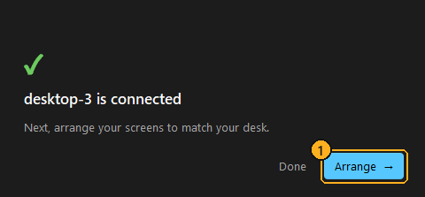

1. **Arrange →** takes you straight to the Arrangement page ([§7](#7-arranging-your-screens)).
   **Done** closes the window.

To add a third computer, do the same from **any** computer already in the group.

### If it doesn't work

The window says what went wrong and what to do. For example:

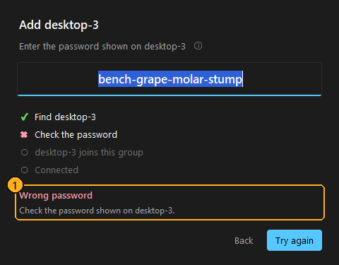

1. What happened, and what to do about it. Correct the password and choose
   **Try again**.

| Message | What to do |
|---|---|
| **Wrong password** | Type the password shown on the *other* computer's Devices page. |
| ***name* not found** | Open Nishro Link on it. If it is open, its firewall may block UDP 8770. |
| **Can't reach *name*** | Its firewall may be blocking TCP 8770. |
| ***name* has its own group** | It is the hub of other devices. Add this computer to *its* group instead: the window offers **Join its group**. |
| **Sharing is off on *name*** | Turn sharing on there, then **Try again**. |
| **Version mismatch** | Install the same major version on both. |
| **Name already in use** | Rename one of the two computers ([§13](#13-managing-devices)). |

### Joining a group instead

If the computer you found already belongs to a group, the list offers
**Join its group** or **Join that group** instead of **Add**. Joining moves
*this* computer into that group; type the password shown on the computer you
chose. A computer that has devices of its own cannot join another group, because
its devices would be left behind.

---

## 7. Arranging your screens

Open **Arrangement**. Every computer is drawn as its real monitors; this
computer's are blue, the others' green, and computers that are offline grey.

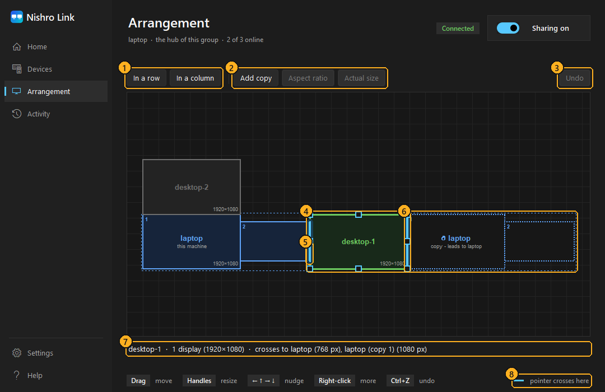

1. **In a row** / **In a column** lay everything out tidily at once.
2. **Add copy**, **Aspect ratio**, **Actual size**: act on the selected screen
   ([§7 Resizing](#resizing-where-the-borders-meet) and
   [§8](#8-wrap-around-copies-of-a-computer)). Each is lit only when it applies.
3. **Undo** takes back the last change (also **Ctrl+Z**).
4. **The selected screen**, with its eight handles.
5. **A bright line: the pointer crosses here.** Wherever two computers' screens
   touch, the pointer can go from one to the other.
6. **A copy** of a computer (dotted), for wrap-around ([§8](#8-wrap-around-copies-of-a-computer)).
7. **In words:** the selected screen, and where the pointer crosses from it.
8. The key to the picture, and what the mouse and keys do here.

### Moving a screen

- **Drag** a computer's screens to where they are on your desk. It snaps to its
  neighbours' edges and corners.
- Or select it and use the **arrow keys**; hold **Shift** for bigger steps.

**A change applies on every computer the moment you let go.** There is no Save.
If you didn't mean it, **Undo**.

### Resizing: where the borders meet

A screen's box can be resized by its handles:

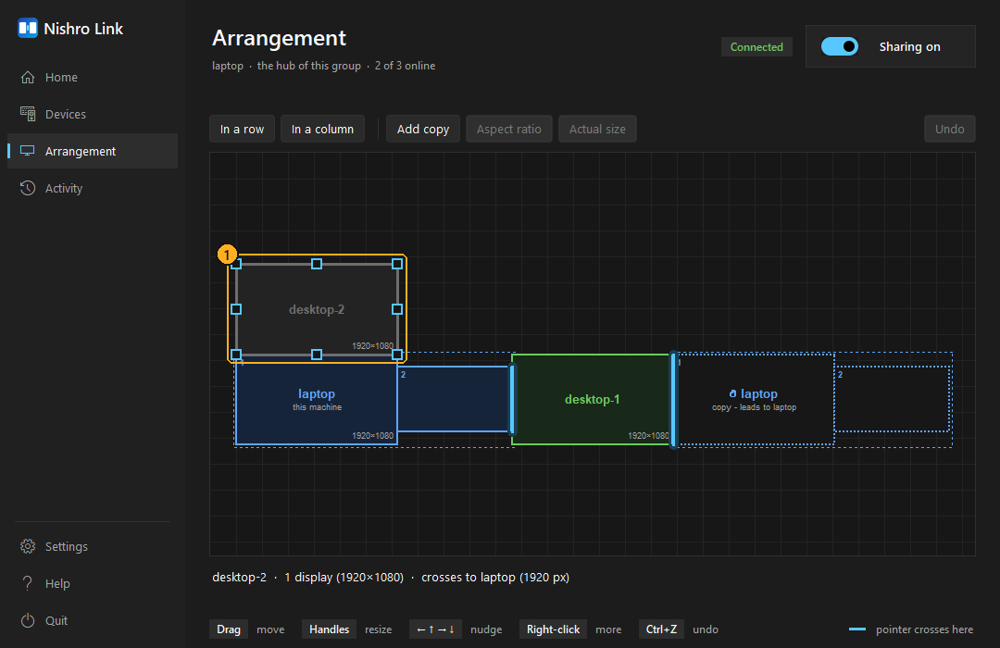

1. Drag a **corner** or **edge** handle.

Resizing changes **only where the borders meet**, never how far or how fast the
pointer moves on each screen. Use it, for example, so a small laptop screen
meets a large monitor along its whole edge.

- **Aspect ratio** puts a resized box back to the computer's own proportions.
- **Actual size** puts it back to its real size.

### Right-click for everything

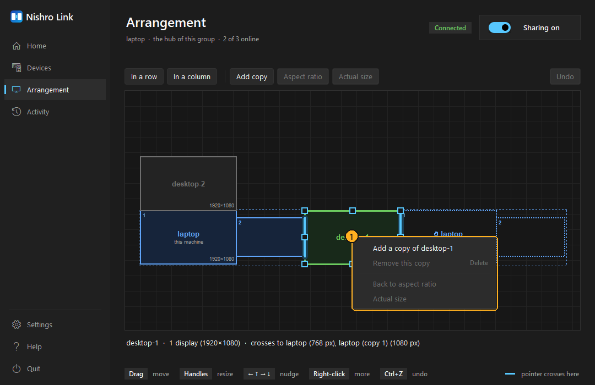

1. Right-click a screen: add a copy of it, remove a copy, go back to the aspect
   ratio or the actual size.

### When something is wrong, it says so

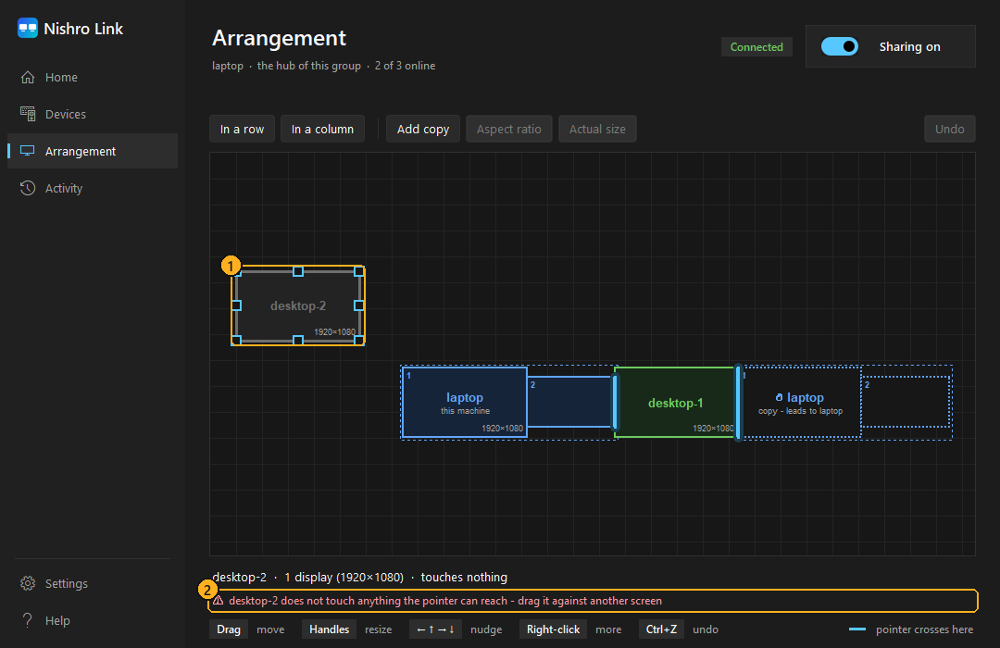

1. A screen that touches no other screen: the pointer could never reach it.
2. The problem, in words. Drag it against another screen and the message goes.

### Monitors plugged in or out

Noticed within seconds; the arrangement updates on every computer. On Linux,
restart Nishro Link on that computer for the pointer to use the new size
(`sudo systemctl restart nishro-link`).

---

## 8. Wrap-around: copies of a computer

A **copy** is a second box for the same computer. When the pointer enters the
copy, it arrives on the computer itself, as if through that edge.

**Example:** laptop and desktop side by side. You want to go right off the
desktop and come back onto the laptop's left side:

1. On **Arrangement**, select the **laptop**.
2. Choose **Add copy** (or right-click → **Add a copy of laptop**). The copy
   appears, dotted, clear of everything.
3. Drag the copy against the **right** edge of the desktop. A bright line shows
   the new crossing.

Now pushing right off the desktop brings the pointer back in on the laptop's
left edge. In the picture in [§7](#7-arranging-your-screens), callout **6** is
exactly this.

- A copy is always the whole computer, all its monitors.
- Copies can be moved and resized like any box, up to eight per computer.
- To remove one, select it and press **Delete**, or right-click → **Remove this
  copy**.

---

## 9. Everyday use

**Moving across.** Push the pointer off the edge of a screen across a bright
line, and it appears on the next computer.

**Taking control.** Just move the other computer's mouse. With **Settings →
What takes control → A click** it takes a click instead; useful if a mouse gets
bumped ([§14](#14-settings)).

**Typing.** Keys go to the computer whose screen the pointer is on. Letters
follow that computer's keyboard layout, as if the keyboard were plugged into it.
So do the volume, mute and media keys, a keyboard's volume dial, and
brightness: they act on the computer the pointer is on. Power, sleep and wake
keys always act on the computer the keyboard is plugged into. (On Windows, brightness
changes the built-in screen only; a laptop's own Fn brightness keys are
handled by its hardware and always act on the laptop.)

**Copy and paste.** Copy text or an image (a screenshot, a photo, an image
from a web page) on one computer, move to another, paste. Images up to 16 MB.
Files don't cross yet.

**At the lock and sign-in screens.** Because Nishro Link runs as a service from
boot, you can use another computer's mouse and keyboard to sign in.

**Pausing.** Turn the **Sharing** switch off, top right, or untick **Sharing**
in the tray icon's menu. Everything stops on this computer, and the others
treat it as away. Turn it back on to carry on; the group is kept.

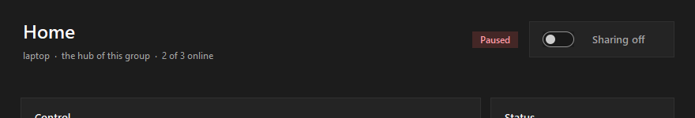

---

## 10. The tray icon and the dock

The everyday controls, without opening the window. Nishro Link keeps an icon in
the **notification area** on Windows (by the clock, or under its **^** arrow)
and in the **top bar** on Ubuntu. It starts whenever you sign in. (It comes
with the Windows setup and the `.deb`. Run from source, the window has the same
controls.)

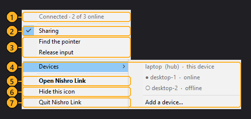

1. **The state**, in words: connected and how many devices are online, sharing
   off, waiting for the other devices, or setup needed.
2. **Sharing.** Untick to pause sharing, tick to carry on: the same as the
   switch on Home ([§9](#9-everyday-use)).
3. **Find the pointer** and **Release input**
   ([§11](#11-finding-the-pointer), [§12](#12-getting-your-computer-back)).
4. **Devices:** every device in the group, and whether it is online
   (● online, ○ offline). **Add a device…** opens the window at adding one
   ([§6](#6-connecting-your-computers)).
5. **Open Nishro Link** opens the window.
6. **Hide this icon** removes the icon until you next sign in or open the
   window. Sharing carries on.
7. **Quit Nishro Link** stops it completely ([§5](#quitting)).

**The icon shows the state** at a glance:


- **Blue:** connected, or ready for a device to be added.
- **Grey:** sharing is off on this computer.
- **An amber dot:** something needs you: not connected to the others, setup
  needed (Linux), or the background service is not running. Hover over the
  icon, or open its menu, to see which.

**Notifications.** When a device connects or drops out, a notification says
so. Turn them off with **Settings → Notify when a device connects or drops**
([§14](#14-settings)).

**On Windows**, click the icon to open the window, and right-click it for the
menu. To keep it in view, drag it from under the **^** arrow on to the taskbar.

**On Linux**, click the icon for the menu. Ubuntu and KDE Plasma show tray
icons as they come, as do most other desktops. Plain GNOME (Debian, Fedora)
needs the **AppIndicator and KStatusNotifierItem Support** extension, from the
`gnome-shell-extension-appindicator` package.

### The dock's right-click menu (Linux)

Right-click **Nishro Link** in the dock or the app grid:

| Choice | Does |
|---|---|
| **Find the pointer** | Shows where the pointer is, on whichever computer it is. |
| **Release input** | Gives every computer back its own mouse and keyboard. |
| **Pause sharing** / **Resume sharing** | Turns sharing off or on. |

These work with or without a tray icon.

---

## 11. Finding the pointer

Lost the pointer among several screens?

**Shake the mouse**: a few quick movements left and right. Every screen darkens
except a circle round the pointer, **on whichever computer it is**:

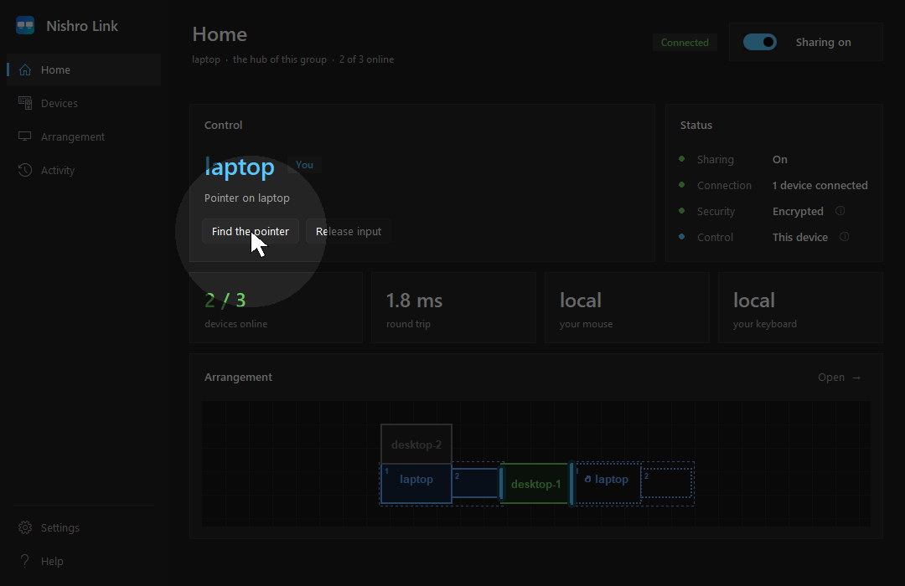

- **Find the pointer**, on Home or in the tray icon's menu, does the same.
- **On Ubuntu and other GNOME desktops**, GNOME's own ripple round the pointer
  is shown instead of the circle. Other Linux desktops don't show anything yet.
- Don't want it? Turn off **Settings → Shake the mouse to find the pointer**.

---

## 12. Getting your computer back

Nishro Link gives every computer back its own mouse and keyboard whenever
anything is in doubt: when a connection drops, a device leaves, or the program
stops. You can also do it yourself at any time:

- press **both Ctrl keys** together, on any computer; or
- choose **Release input**, on Home or in the tray icon's menu.

---

## 13. Managing devices

Everything about the group is on **Devices**:


1. **This device's name and password**, what another computer types to add it.
2. **Copy** the password.
3. **New password** (on the hub): makes a new password for the whole group.
   Devices connected now receive it automatically; any that are switched off
   ask for it when they return.
4. **Rename** or see **Details** of this device.
5. **+ Add a device** ([§6](#6-connecting-your-computers)).
6. **The devices in the group**, each with **Details**, **Rename** and
   **Remove**. Online ones show their round trip and network address; offline
   ones when they were last seen.
7. **Nearby:** computers found on the network that are not in the group, with
   what can be done (**Add**, **Join its group**). **Refresh** searches again.

**Right-click** a device for the same actions:

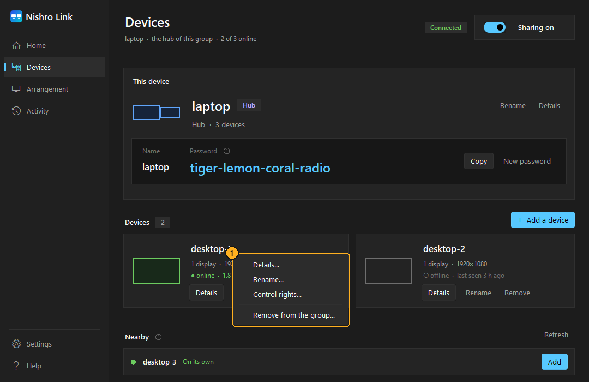

1. **Details…**, **Rename…**, **Control rights…**, **Remove from the group…**.
   An action that isn't possible right now is greyed out: control rights need
   the device to be online, for example.

### Details

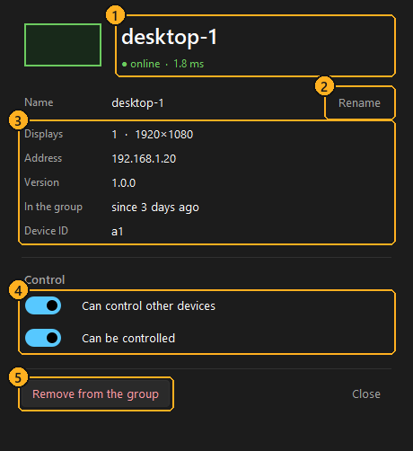

1. The device, and whether it is online (with its round trip) or when it was
   last seen.
2. **Rename** it.
3. Its displays, network address, version, when it joined, and its device ID.
4. **Control rights:**
   - **Can control other devices:** off, and its mouse and keyboard stay its
     own.
   - **Can be controlled:** off, and no other computer's input reaches it. It
     becomes a wall the pointer stops at.
5. **Remove from the group** (asks first).

### Renaming

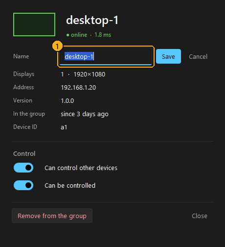

1. Type the new name and press **Enter**. It applies at once on every computer,
   without restarting. A device that is off takes its new name when it next
   connects.

### Removing and leaving

- **Remove from the group** makes the device a group of one again, with a new
  password of its own. The hub then refuses it until it is added again on
  purpose. It still knows the group's password, though: if you no longer trust
  whoever has it, also make a **New password**.
- A member can **Leave this group** from its own Devices page.

### When this device's password stopped working

If the hub's password was changed while this computer was off, its Devices page
says the hub rejected its password, with an **Update password** button. Choose
it and type the group's new password.

---

## 14. Settings

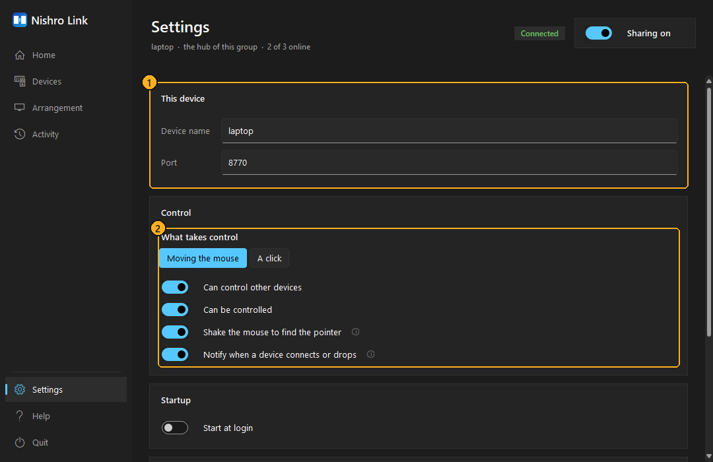

1. **This device:**
   - **Device name:** how the other computers see it.
   - **Port:** 8770 unless something else on the computer uses it. If you
     change it, change it on every computer in the group.
2. **Control:**
   - **What takes control:** **Moving the mouse** (a small deliberate movement)
     or **A click**.
   - **Can control other devices** / **Can be controlled:** this computer's
     rights ([§13](#details)).
   - **Shake the mouse to find the pointer** ([§11](#11-finding-the-pointer)).
   - **Notify when a device connects or drops:** the tray icon's
     notifications ([§10](#10-the-tray-icon-and-the-dock)).

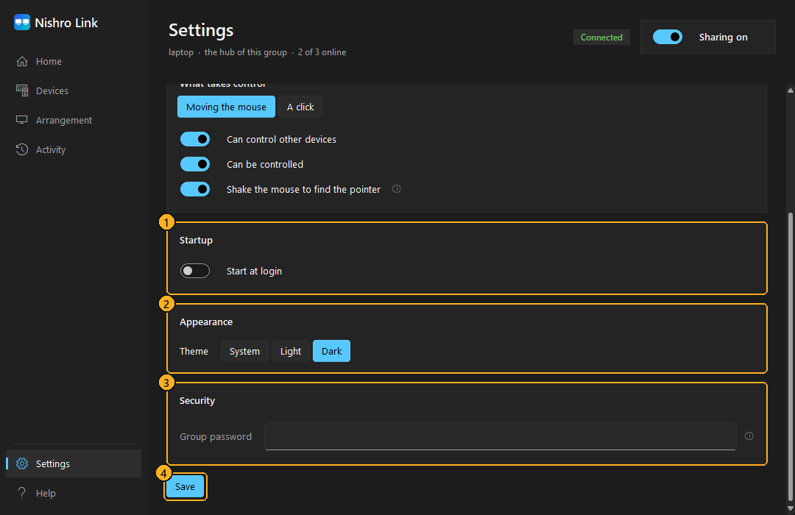

1. **Startup.** Installed with the setup or the `.deb`, Nishro Link **starts
   with the computer**, before anyone signs in, and this card says so. Run from
   source, it offers **Start at login** instead.
2. **Appearance:** **System** follows the computer's own light or dark setting;
   **Light** and **Dark** choose one.
3. **Security:** the **group password**, on the hub. Leave it empty to keep the
   current one. On other devices this is set by the hub.
4. **Save** applies the name, port, password and control choices. The theme,
   startup, shake and notify switches apply as soon as you change them.

---

## 15. Activity and logs

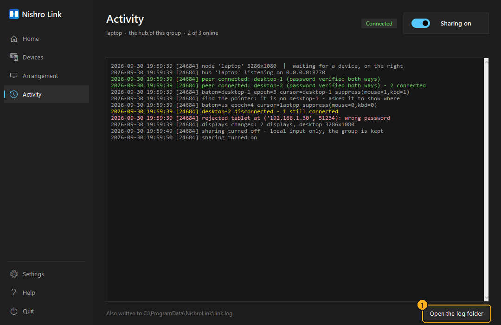

Everything Nishro Link has done recently, newest last: devices connecting and
leaving (green), connections lost (amber), refusals such as a wrong password
(red), and every change of control.

1. **Open the log folder** shows the full log file.

| | Log file |
|---|---|
| **Windows** | `C:\ProgramData\NishroLink\link.log` |
| **Linux** | `/var/log/nishro-link/link.log` (or `journalctl -u nishro-link`) |

The log records device names, addresses and events. It never records passwords
or what you type.

---

## 16. Help and About

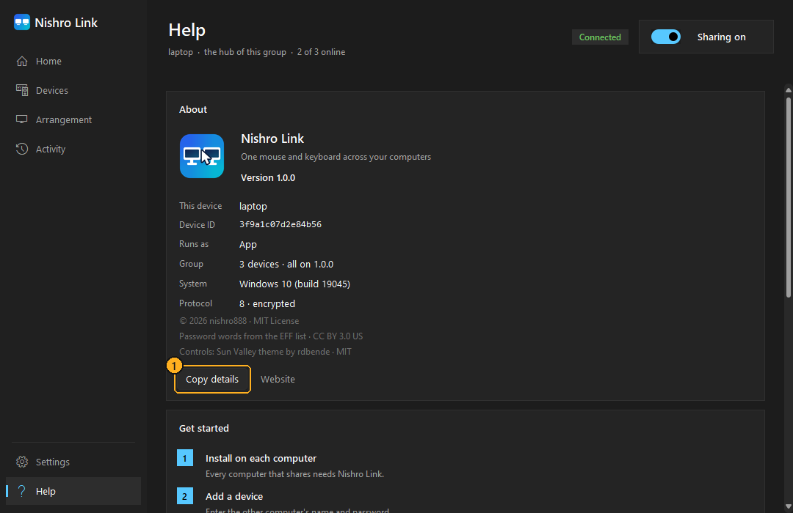

- **About:** the version, this device's name and ID, how it runs (**Background
  service** or **App**), the group and each device's version, the system and
  the protocol.
- **Copy details** (**1**) copies all of that in one go, which is exactly what a
  bug report needs. It holds no passwords.

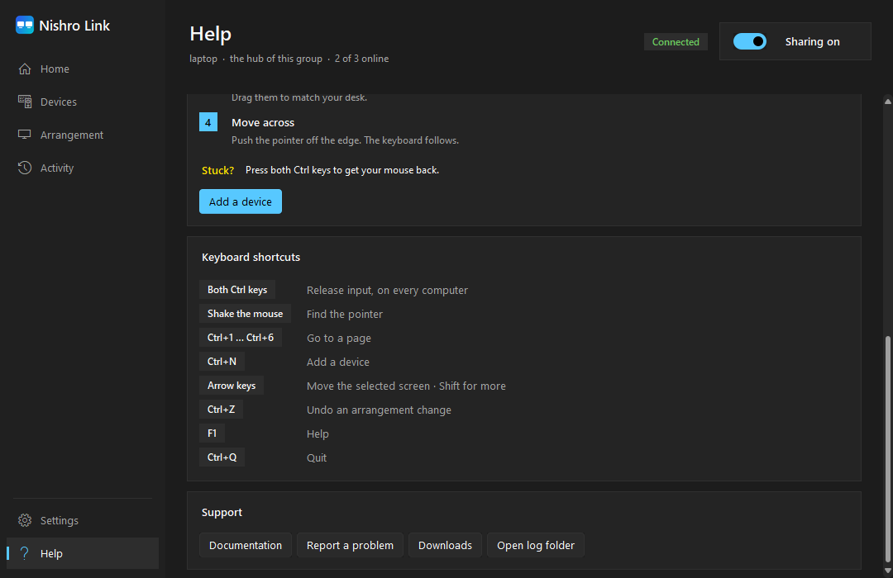

- **Get started:** the four steps, and a reminder that both Ctrl keys give you
  your mouse back.
- **Keyboard shortcuts** ([§17](#17-keyboard-shortcuts)).
- **Support:** the documentation, reporting a problem, downloads, and the log
  folder.

---

## 17. Keyboard shortcuts

| Keys | Does |
|---|---|
| **Both Ctrl keys** | Release input, on every computer |
| **Shake the mouse** | Find the pointer |
| **Ctrl+1 … Ctrl+6** | Go to a page (Home, Devices, Arrangement, Activity, Settings, Help) |
| **Ctrl+N** | Add a device |
| **Arrow keys** | Move the selected screen (hold **Shift** for more) |
| **Delete** | Remove the selected copy |
| **Ctrl+Z** | Undo an arrangement change |
| **F1** | Help |
| **Ctrl+Q** | Close the window |

**From a command line, or a shortcut of your own**, the everyday controls:

| Command | Does |
|---|---|
| `nishro-link --sharing off` | Pauses sharing (`on` carries on; `toggle` switches) |
| `nishro-link --find-pointer` | Find the pointer |
| `nishro-link --release-input` | Release input |

On Windows the program is `C:\Program Files\Nishro Link\NishroLink.exe`. To
put one on a key, add it as a custom shortcut in your desktop's keyboard
settings.

---

## 18. Updating and uninstalling

**Updating.** Install the new version the same way as the first time: run the new
setup on Windows, install the new `.deb` on Linux. Your devices and arrangement
are kept. Every 1.x version works with every other 1.x, so the computers don't
all have to be updated at once.

**Uninstalling on Windows.** **Settings → Apps → Nishro Link → Uninstall.** It
asks whether to remove your settings and pairing too: **No** keeps them for a
later reinstall.

**Uninstalling on Linux.**

```bash
sudo apt remove nishro-link     # keeps the settings
sudo apt purge nishro-link      # removes the settings and the log too
```

---

## 19. When something is wrong

**The window shows a red banner: "Windows Firewall is blocking Nishro Link".**
Windows added a rule blocking it, usually after its own "allow access" question
was dismissed.

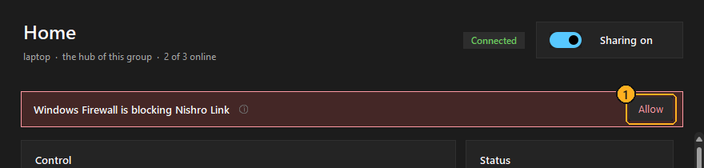

1. Choose **Allow**, then **Yes** in Windows' permission prompt.

**The window shows a red banner: "… is a public network".** Windows calls
the network this computer is on Public, and its firewall then keeps every
other device out. Nishro Link is allowed on private networks only: a café's
Wi-Fi is exactly where a computer should not answer strangers. It happens
when a laptop joins a network it has never seen before - even the same
router's other band (2.4 GHz rather than 5 GHz).

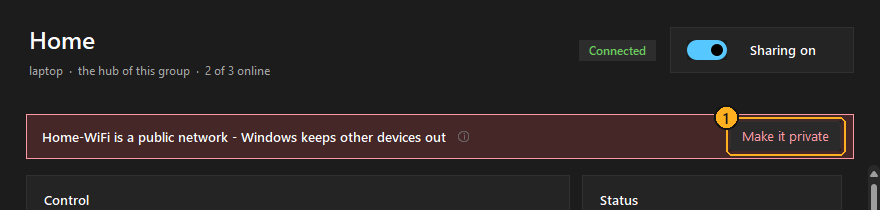

1. If it is your own home or work network, choose **Make it private**, then
   **Yes** in Windows' permission prompt. If it isn't, use a network that is.

**Devices do not find each other.** Check, in order:

1. Both are on the same network.
2. Sharing is on on both.
3. Windows: the network is set to **Private**: the window says so if it
   isn't (above).
4. Linux with a firewall: `sudo ufw allow 8770`.
5. The network lets devices see each other. Guest Wi-Fi, "client isolation" and
   some VPNs don't.

**The pointer lags.** Almost always Wi-Fi: its power saving, or a weak signal.
Nishro Link keeps both computers' radios awake while the pointer is across, but
it cannot do everything. Use 5 GHz Wi-Fi or a cable if you can; on a computer
that is always plugged in, turn its Wi-Fi power saving off. The round trip on
Home shows how quick the link is: a few milliseconds is good.

**A key seems stuck.** Press both Ctrl keys.

**There is no tray icon.** On Windows, look under the **^** arrow by the
clock; if it isn't there, open Nishro Link once and the icon comes back. On
plain GNOME, add the AppIndicator extension
([§10](#10-the-tray-icon-and-the-dock)); meanwhile the dock's right-click menu
has the same controls.

**A keyboard or mouse plugged in later doesn't work across (Linux).** It is
picked up within two seconds. If not, restart Nishro Link on that computer.

Everything else: [troubleshooting](troubleshooting.md). Still stuck?
[Report a problem](https://github.com/nishro888/nishro-link/issues/new/choose),
with **Help → Copy details** from each computer.

---

## 20. Glossary

| Word | Meaning |
|---|---|
| **Group** | The computers that work together. Every computer is in exactly one; a new install is a group of one. |
| **Hub** | The computer the others connect to. It decides who is in control and keeps the arrangement. Any computer can be the hub; its mouse is no different from the others'. |
| **Member** | Any computer in a group that is not the hub. |
| **Control** | Which computer's mouse is driving right now. |
| **Pointer on…** | Which screen the pointer is on. The keyboard goes there. |
| **Password** | Four words each computer makes up for itself. Typed on another computer to add it; never sent over the network. |
| **Arrangement** | Where every computer's screens are, relative to each other. |
| **Copy** | A second box for a computer, so the pointer can wrap around to it. |
| **Round trip** | How long a message takes to reach another computer and come back. |
| **Sharing** | Whether this computer takes part right now. Off pauses it without leaving the group. |
| **Tray icon** | Nishro Link's icon by the clock (Windows) or in the top bar (Linux), with the everyday controls in its menu. |
| **Service** | The part of Nishro Link that runs in the background from boot. The window only shows it and changes its settings. |

---

*Nishro Link is free software under the [MIT License](../LICENSE). More
documentation: [docs](README.md).*
